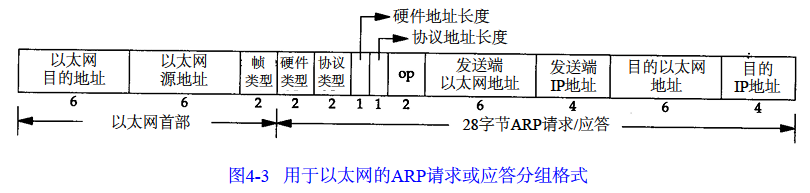

ARP 报文格式

==以太网目的地址：48bit都为1的广播地址==，默认发送给所有主机

帧类型：表示后面数据的类型，ARP请求或应答都为0x0806

硬件类型：表示硬件地址的类型，1  表示以太网地址

协议类型：表示要映射的协议地址类型，0x0800表示IP地址

硬件地址长度：硬件地址的长度，字节。以太网上 IP 地址的ARP请求或应答值为 6

协议地址长度：协议地址的长度，字节。以太网上 IP 地址的ARP请求或应答值为 4

操作字段：表示操作类型。1： ARP请求，2 ： ARP应答，3：RARP请求，4：RARP应答

剩余四个字段为重复信息。
