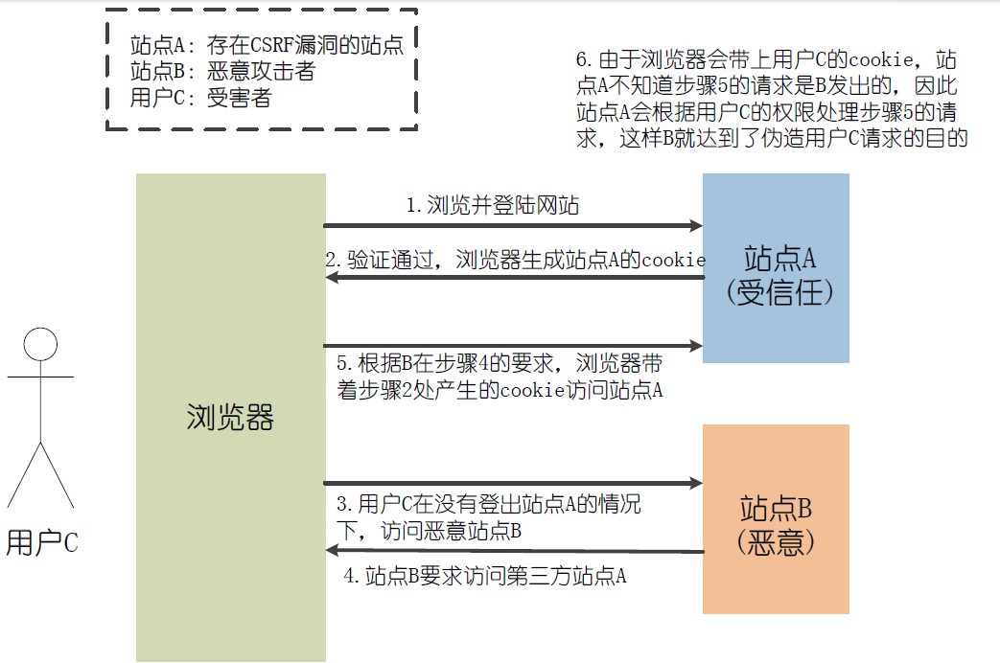

### CSRF攻击

CSRF攻击的全称是跨站请求伪造(cross site request forgery)，是一种对网站的恶意利用，尽管听起来跟XSS跨站脚本攻击有点相似，但事实上CSRF与XSS差别很大，XSS利用的是站点内的信任用户，而CSRF则是通过伪装来自受信任用户的请求来利用受信任的网站。可以这么理解CSRF攻击：攻击者盗用了你的身份，以你的名义向第三方网站发送恶意请求。CRSF能做的事情包括利用你的身份发邮件、发短信、进行交易转账等等，甚至盗取你的账号。



假设某银行网站A，以GET请求来发起转账操作，转账的地址为`www.xxx.com/transfer.do?accountNum=10001&money=10000`，accountNum参数表示转账的目的账户，money参数表示转账金额。而某大型论坛B上，一个恶意用户上传了一张图片，而图片的地址栏中填的并不是图片的地址，而是前面所说的转账地址：

```html

```

当你登陆网站A后，没有及时登出，这个时候你访问了论坛B，不幸的事情发生了，你会发现你的账户里面少了10000块……

为什么会这样呢，在你登陆银行A的时候，你的浏览器端会生成银行A的cookie，而当你访问论坛B的时候，页面上的标签需要浏览器发起一个新的HTTP请求，以获得图片资源，当浏览器发起请求的时候，请求的却是银行A的转账地址`www.xxx.com/transfer.do?accountNum=10001&money=10000`，并且会带上银行A的cookie信息，结果银行的服务器收到这个请求后，会认为是你发起的一次转账操作，因此你的账户里边便少了10000块。

CSRF的防御

1.cookie设置为HttpOnly

CSRF攻击很大程度上是利用了浏览器的cookie，为了防止站内的XSS漏洞盗取cookie，需要在cookie中设置"HttpOnly"属性，这样通过程序(如JavascriptS脚本、Applet等)就无法读取到cookie信息，避免了攻击者伪造cookie的情况出现。

2.增加token

CSRF攻击之所以能够成功，是因为攻击者可以伪造用户的请求，该请求中所有的用户验证信息都存在于cookie中，因此攻击者可以在不知道用户验证信息的情况下直接利用用户的cookie来通过安全验证。由此可知，抵御CSRF攻击的关键在于：在请求中放入攻击者所不能伪造的信息，并且该信息不存在于cookie之中。鉴于此，系统开发人员可以在HTTP请求中以参数的形式加入一个随机产生的token，并在服务端进行token校验，如果请求中没有token或者token内容不正确，则认为是CSRF攻击而拒绝该请求。

3.通过Referer识别

根据HTTP协议，在HTTP头中有一个字段叫Referer，它记录了该HTTP请求的来源地址。在通常情况下，访问一个安全受限页面的请求都来自于同一个网站。比如某银行的转账是通过用户访问`http://www.xxx.com/transfer.do`页面完成，用户必须先登录`www.xxx.com`，然后通过点击页面上的提交按钮来触发转账事件。当用户提交请求时，该转账请求的Referer值就会是提交按钮所在页面的URL`（www.xxx.com/transfer.do）`。如果攻击者要对银行网站实施CSRF攻击，他只能在其他的网站构造请求，当用户通过其他网站发送请求到银行时，该请求的Referer的值是其他网站的地址，而不是银行转账页面的地址。

因此，要防御CSRF攻击，银行网站只需要对于每一个转账请求验证其Referer值，如果是以`www.xxx.com`域名开头的地址，则说明该请求是来自银行网站自己的请求，是合法的。如果Referer是其他网站的话，就有可能是CSRF攻击，则拒绝该请求。