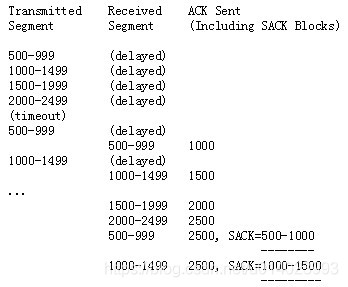

case1: Reporting a duplicate segment.

由于ACK 4000大于[3000,3500]，因此[4000, SACK=3000-3500]是D-SACK。
发送端首先向接收端发送了`3000-3499,3500-3999`报文，并且接收端都收到了。但是接收端返回的ACK 3500及4000都丢失，导致发送端重传了3000-3499报文。
接收端收到发送端重新发送的3000-3499报文，通过[4000，SACK=3000-3500]告知发送端，发送端的`3000-3499`报文接收端重复收到，当前ACK到了4000表示4000之前的数据也都收到。

case2: Reporting an out-of-order segment and a duplicate segment.

[4000, SACK=4500-5000]不满足D-SACK的条件，其是普通的SACK。而[4000, SACK=3000-3500, 4500-5000]是D-SACK，
含义是：4000前的数据已收到，3000-3500的数据重复收到，4000-4499的包丢失，4500-5000的包收到。

case3:Reporting a duplicate of an out-of-order segment.

[4000, SACK=4500-5000]及[4000, SACK=4500-5500]都是普通的SACK，[4000, SACK=5000-5500, 4500-5500]是D-SACK（第二判断方法），
含义是：4000前的包收到，5000-5499包重复收到，4500-5500的包都收到，4000-4499的包丢失。

case4: Reporting a single duplicate subsegment.

发送端以500字节大小发送报文500-999、1000-1499、1500-1999、2000-2499的报文，而1000-1499因为网络延迟而没有及时到达接收端，1500-1999丢失了。
接收端通过[1000, SACK=2000-2500]告知发送端1000前的报文及2000-2499报文已经收到，1000-1999的报文没有收到。

发送端随后以1000字节大小重传数据1000-1999，

而接收端又收到了1000-1499的报文，于是接收端通过[1500, SACK=2000-2500]先告知发送端1500前的报文及2000-2499的报文都收到，
而1500-1999的报文没有收到，此时接收端又收到了发送端的1000-2000报文，于是通过D-SACK[2500, SACK=1000-1500]告知发送端2500前的报文全部收到，1000-1500的报文重复收到。

D-SACK可以判断出网络包是否被复制了：

D-SACK可以判断因为乱序导致的错误重传：

D-SACK可以判断ACK丢失导致的超时重传：

D-SACK可以判断过早超时重传（RTO太小）：

