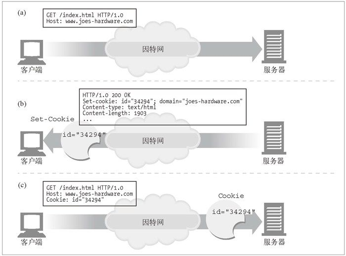
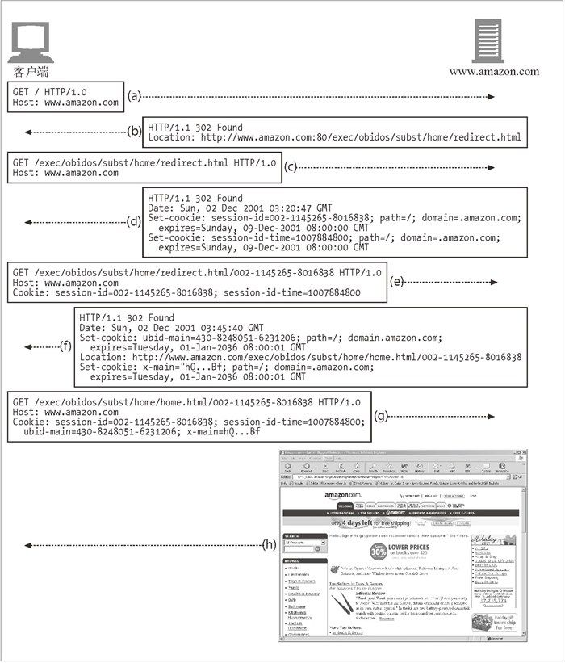

HTTP Cookie
cookie : 用于当前识别用户以实现持久会话。 cookie 分为两类：会话 cookie 和持久 cookie。
会话 cookie ：临时 cookie，记录了用户访问站点时的设置和偏好。用户退出浏览器时，会话 cookie 就被删除。
持久 cookie ：生存时间更长；存储在硬盘上，浏览器退出，计算机重启时它们仍然存在。
> 会话 cookie 和持久 cookie 之间唯一的区别就是它们的过期时间。

工作流程
用户首次访问 Web 站点时，Web 服务器给当前用户设置一个独有的 cookie，以便后期进行识别。cookie 中包含了一个由名字 = 值（name=value）这样的信息构成的任意列表，并通过 Set-Cookie 或 Set-Cookie2 HTTP 响应（扩展）首部将其贴到用户身上去。浏览器会记住从服务器返回的 Set-Cookie 或 Set-Cookie2 首部中的 cookie 内容，并将 cookie 集存储在浏览器的 cookie 数据库中（把它当作一个贴有不同国家贴纸的旅行箱）。将来用户返回同一站点时（参见图 11-3c），浏览器会挑中那个服务器贴到用户上的那些 cookie，并在一个 cookie 请求首部中将其传回去。



 Cookie 标准
 目前使用最广泛的 Cookie 标准不是 RFC 中定义的任何一个，而是在网景公司制定的标准上进行扩展后的产物。


|Set-Cookie属性 | 描述及实例|
|---|---|
| NAME=VALUE  | 强制的。NAME 和 VALUE 都是字符序列，在后继对站点的访问中会将其送回给 Web 服务器： Set-Cookie: customer=Mary|
| Expires | 可选的。定义cookie 的实际生存期过期后就不再存储或发布这个 cookie 。日期的格式为：<br/>Weekday, DD-Mon-YY HH:MM:SS GMT<br/>Set-Cookie: foo=bar; expires=Wednesday, 09-Nov-99 23:12:40 GMT|
| Domain  | 可选的。浏览器只向指定域中的服务器主机名发送cookie。|
| Path  |可选的。通过这个属性可以为服务器上特定的URL分配cookie。 如果没有指定路径，就将其设置为产生 Set-Cookie 响应的 URL 的路径：<br/>Set-Cookie: lastorder=00183; path=/orders|
| Secure  |可选的。如果包含了这一属性，就只有在 HTTP 使用 SSL 安全连接时才会发送 cookie：<br/> Set-Cookie: private_id=519; secure|

客户端发送请求时，会将所有与域、路径和安全过滤器相匹配的未过期 cookie 都发送给这个站点。所有 cookie 都被组合到一个 Cookie 首部中：
```
Cookie: session-id=002-1145265-8016838; session-id-time=1007884800
```

cookie与会话跟踪

可以用 cookie 在用户与某个 Web 站点进行多项事务处理时对用户进行跟踪。电子商务 Web 站点用会话 cookie 在用户浏览时记录下用户的购物车信息。

