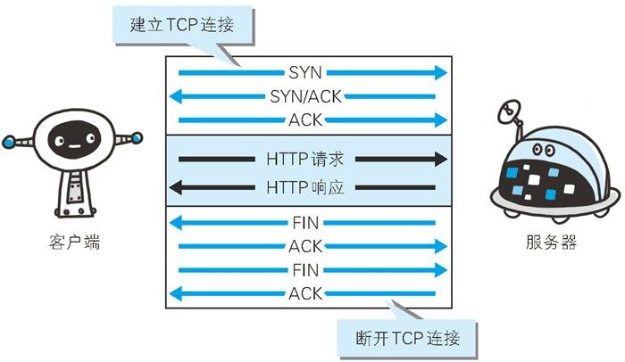
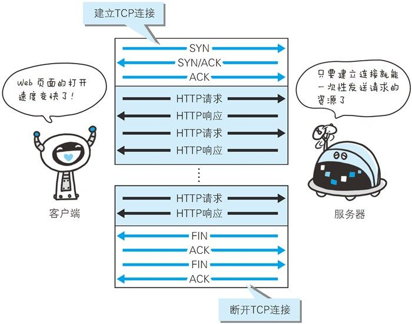
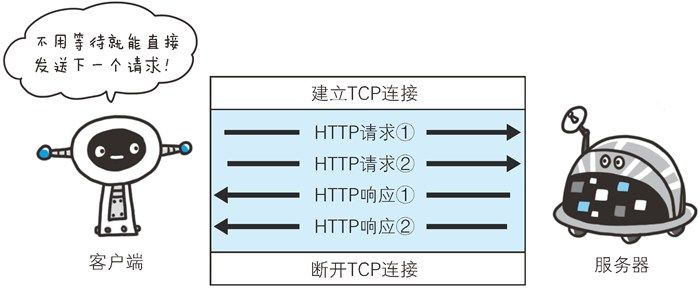
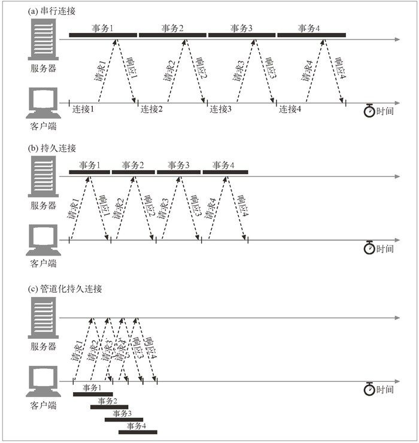

HTTP 协议的初始版本中，每进行一次 HTTP 通信就要断开一次 TCP 连接。为了避免大量建立不必要的连接，HTTP/1.1 和一部分的 HTTP/1.0 提出了持久连接（HTTP Persistent Connections，也称为 HTTP keep-alive 或 HTTP connection reuse）的方法。只要任意一端没有明确提出断开连接，则保持 TCP 连接状态。

> 在事务处理结束之后仍然保持在打开状态的 TCP 连接被称为持久连接

HTTP/1.1 中，所有的连接默认都是持久连接。

管线化连接

HTTP/1.1 允许在持久连接上可选地使用请求管道。即首先将多条请求放入队列，然后在第一条响应到达之前可以继续发送第二条请求。

