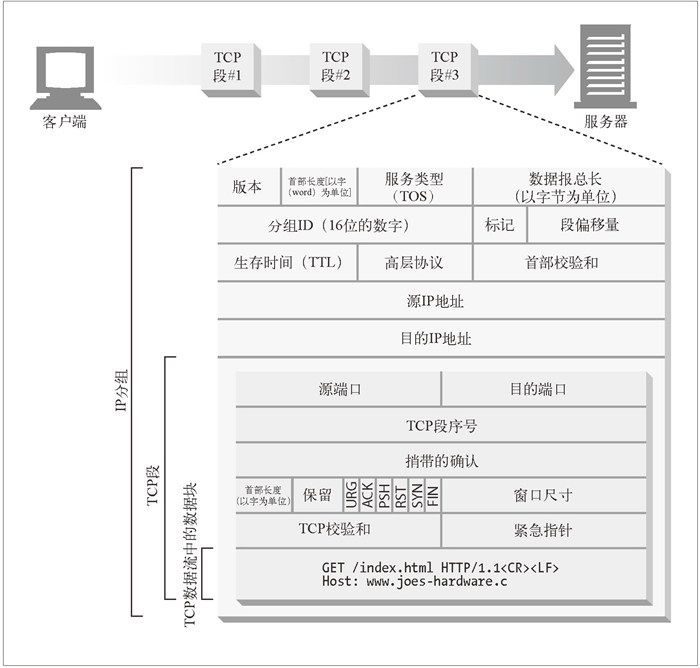
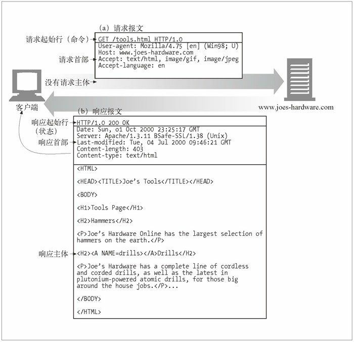

HTTP报文

HTTP是应用层协议，具体的通信细节由TCP/IP提供。发送的数据流最终分解为一个或个IP分组。


HTTP 报文可以分为：请求报文（request message），响应报文（response message）
> 客户端发往服务器的报文，服务器发往客户端的报文

HTTP报文通过换行符（CRLF）划分为三个部分：
起始行：报文的第一行。在请求报文中用来说明<u>要做些什么</u>，在响应报文中用来说明<u>发生了什么</u>。
首部字段：提供请求或响应需要的内容，起始行后空行前。格式为：name:value。首部之后是一个空行
报文主体：具体的的数据。
> 通过Content-Length 说明主体的长度，Content-Type 说明文档的 MIME 格式。

请求报文

```
<method> <request-URL> <version> // 请求行
<headers>

<entity-body>
```

响应报文

```
<version> <status> <reason-phrase> // 响应行
<headers>

<entity-body>
```


