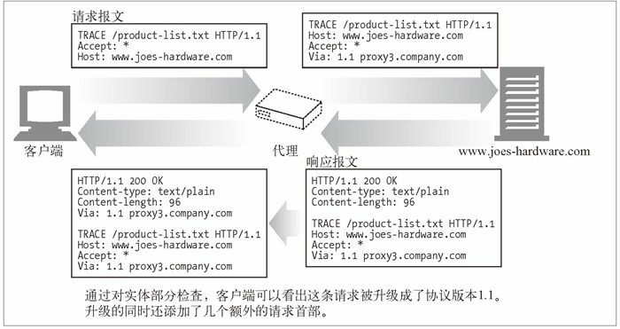

HTTP 方法（HTTP method）：表示服务器需要执行的动作。

|HTTP方法 | 描　　述|
| --- | --- |
| GET    | 从服务器获取一份命名资源 |
| PUT    | 让服务器用请求的主体部分来创建一个由所请求的 URL 命名的新文档或修改现有的文档 |
| DELETE | 从服务器中删除命名资源 |
| POST   | 通常用于 HTML 的表单将填好的数据通常会被送给服务器 |
| HEAD   | 只从服务器获取命名资源的首部 |
| TRACE   | 对可能经过代理服务器传送到服务器上去的报文进行追踪 |
| OPTIONS   | 询问服务器通常支持哪些方法 |

> TRACE 请求会在目的服务器端发起一个“环回”诊断。在行程最后一站的服务器会弹回一条 TRACE 响应，并在响应主体中携带它收到的原始请求报文。请求中不能带有实体的主体部分
>
> 

服务器可以扩展HTTP1.1定义的方法，以下是WebDAV HTTP常见的扩展方法
| 方　　法 |    描　　述 |
| --- | --- |
| LOCK    | 允许用户“锁定”资源——比如，可以在编辑某个资源的时候将其锁定，以防别人同时对其进行修改 |
| MKCOL   | 允许用户创建资源 |
| COPY    | 便于在服务器上复制资源 |
| MOVE    | 在服务器上移动资源 |