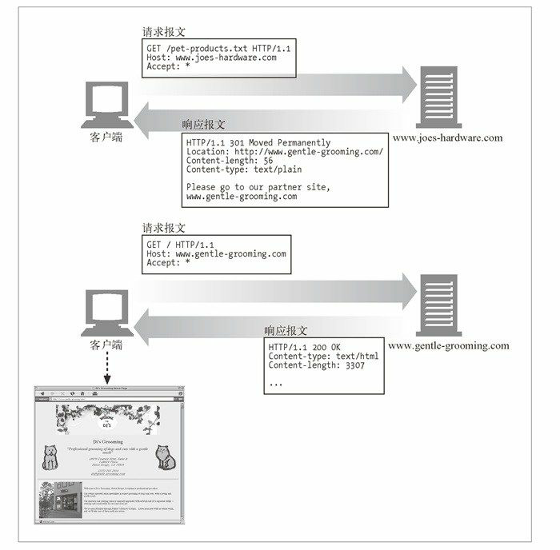

HTTP状态码

HTTP方法是用来告诉服务器做什么事情的，状态码则用来告诉客户端，发生了什么事情。

| 整体范围  | 已定义范围 | 分　类 |
|---|---|---|
| 100～199 | 100～101 | 信息提示 |
| 200～299 | 200～206 | 成功 |
| 300～399 | 300～305 | 重定向 |
| 400～499 | 400～415 | 客户端错误 |
| 500～599 | 500～505 | 服务器错误 |

| HTTP状态码   | 描　　述 |
|---|---|
| 200 | OK。命名资源正确返回 |
| 302 | Redirect（重定向）。到其他地方去获取资源 |
| 404 | Not Found（没找到）。无法找到这个资源 |

100～199——信息性状态码

| 状态码 | 原因短语 | 含　　义|
|---|---|---|
|100 | Continue  | 说明收到了请求的初始部分，请客户端继续。发送了这个状态码之后，服务器在收到请求之后必须进行响应。 |
|101| Switching Protocols |说明服务器正在根据客户端的指定，将协议切换成Update首部所列的协议 |

200～299——成功状态码

| 状态码 | 原因短语 | 含　　义|
|---|---|---|
| 200 | OK  | 请求没问题，实体的主体部分包含了所请求的资源 |
| 201 | Created |用于创建服务器对象的请求（比如，PUT）。 |
| 202 | Accepted  |  请求已被接受，但服务器还未对其执行任何动作。 |
| 203 | Non-Authoritative Information |  包含的信息不是来自于源端服务器，而是来自资源的一份副本（比如缓存）。 |
| 204 | No Content  |响应报文中包含若干首部和一个状态行，但没有实体的主体部分。 |
| 205 | Reset Content  | 另一个主要用于浏览器的代码。负责告知浏览器清除当前页面中的所有HTML 表单元素。 |
| 206 | Partial Content | 成功执行了一个部分或Range（范围）请求。 |

300～399——重定向状态码
>重定向状态码要么告知客户端使用替代位置来访问他们所感兴趣的资源，要么就提供一个替代的响应而不是资源的内容

| 状态码 | 原因短语 | 含　　义|
|---|---|---|
| 300 | Multiple Choices  |  客户端请求一个实际指向多个资源的URL时会返回这个状态码，如服务器上有某个HTML文档的英语和法语版本。 |
| 301 | Moved Permanently |  在请求的URL已被移除时使用。响应的Location首部中应该包含资源现在所处的URL |
| 302 | Found  | 客户端应该使用Location首部给出的URL来临时定位资源。将来的请求仍应使用老的URL |
| 303 | See Other  | 告知客户端应该用另一个URL来获取资源。 |
| 304 | Not Modified | 客户端发起了一个条件GET请求，而最近资源未被修改的话，就可以用这个状态码来说明资源未被修改。 |
| 305 | Use Proxy  | 用来说明必须通过一个代理来访问资源；代理的位置由Location首部给出。 |
| 306 | （未使用） | 当前未使用 |
| 307 | Temporary Redirect | 与301状态码类似；但客户端应该使用Location首部给出的URL来临时定位资源。将来的请求应该使用老的URL |

400～499——客户端错误状态码

| 状态码 | 原因短语 | 含　　义|
|---|---|---|
| 400 | Bad Request | 用于告知客户端它发送了一个错误的请求 |
| 401 | Unauthorized| 客户端在获取对资源的访问权之前需要先进行认证。|
| 402 | Payment Required | 未使用|
| 403 | Forbidden   | 用于说明请求被服务器拒绝了。|
| 404 | Not Found   | 用于说明服务器无法找到所请求的URL。|
| 405 | Method Not Allowed  | 发起的请求中带有所请求的URL不支持的方法 |
| 406 | Not Acceptable | 服务器没有与客户端可接受的URL相匹配的资源时 |
| 407 | Proxy Authentication Required   | 与401状态码类似，但用于要求对资源进行认证的代理服务器|
| 408 | Request Timeout |如果客户端完成请求所花的时间太长，服务器可以回送此状态码，并关闭连接。|
| 409 | Conflict    |用于说明请求可能在资源上引发的一些冲突。|
| 410 | Gone  |  与404类似，只是服务器曾经拥有过此资源。|
| 411 | Length Required |服务器要求在请求报文中包含Content-Length首部时使用|
| 412 | Precondition Failed | 客户端发起了条件请求，但其中一个条件失败了。|
| 413 | Request Entity Too Large    | 客户端发送的实体主体部分比服务器能够或者希望处理的要大|
| 414 | Request URI Too Long    | 客户端所发请求中的请求URL比服务器能够或者希望处理的要长时|
| 415 | Unsupported Media Type  |服务器无法理解或无法支持客户端所发实体的内容类型时|
| 416 | Requested Range Not Satisfiable | 请求报文所请求的是指定资源的某个范围，而此范围无效或无法满足|
| 417 | Expectation Failed  | 请求的Expect请求首部包含了一个期望，但服务器无法满足此期望时，使用此状态码|

500～599——服务器错误状态码

|状态码 | 原因短语   | 含　　义|
|---|---|---|
| 500 | Internal Server Error   |服务器遇到一个妨碍它为请求提供服务的错误时，使用此状态码|
| 501 | Not Implemented | 客户端发起的请求超出服务器的能力范围|
| 502 | Bad Gateway |作为代理或网关使用的服务器从请求响应链的下一条链路上收到了一条伪响应|
| 503 | Service Unavailable |用来说明服务器现在无法为请求提供服务 |
| 504 | Gateway Timeout | 与状态码408类似，只是这里的响应来自一个网关或代理，它们在等待另一服务器对其请求进行响应时超时了|
| 505 | HTTP Version Not Supported |  服务器收到的请求使用了它无法或不愿支持的协议版本 |