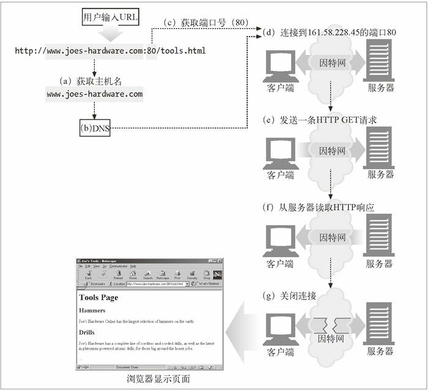

HTTP连接

在 HTTP 客户端向服务器发送报文之前，需要用网际协议（Internet Protocol，IP）地址和端口号在客户端和服务器之间建立一条 TCP/IP 连接。连接的具体步骤如下：
(a) 浏览器从 URL 中解析出服务器的主机名；
(b) 浏览器将服务器的主机名转换成服务器的 IP 地址；
(c) 浏览器将端口号（如果有的话）从 URL 中解析出来；
(d) 浏览器建立一条与 Web 服务器的 TCP 连接；
(e) 浏览器向服务器发送一条 HTTP 请求报文；
(f) 服务器向浏览器回送一条 HTTP 响应报文；
(g) 关闭连接，浏览器显示文档。

