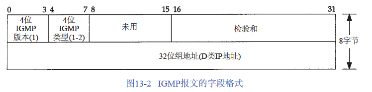

IGMP (Internet Group Management Protocol)： 多播路由器使用IGMP报文来记录与该路由器相连网络中组成员的变化情况

> 应用程序可以调用系统接口加入或退出具体的多播组

类型：1：多播路由器发出的查询报文。2：主机发出的报告报文

组地址：D类I P地址，查询报文中设置为 0，报告报文中设置为要参加的组地址

使用流程：

1. 当第一个进程加入一个组时，主机就发送一个 IGMP报告。如果一个主机的多个进程加入同一组，只发送一个IGMP报告。这个报告被发送到进程加入组所在的同一接口上。
2. 进程离开一个组时，主机不发送IGMP报告，即便是组中的最后一个进程离开。主机知道在确定的组中已不再有组成员后，在随后收到的 IGMP查询中就不再发送报告报文。
3. 多播路由器定时发送IGMP查询来了解是否还有任何主机包含有属于多播组的进程。多播路由器必须向每个接口发送一个IGMP查询。因为路由器希望主机对它加入的每个多播组均发回一个报告，因此IGMP查询报文中的组地址被设置为0。
4. 主机通过发送IGMP报告来响应一个IGMP查询，对每个至少还包含一个进程的组均要发回IGMP报告。

> 多播路由器对每个接口保持一个表，表中记录接口上至少还包含一个主机的多播组

#ignore