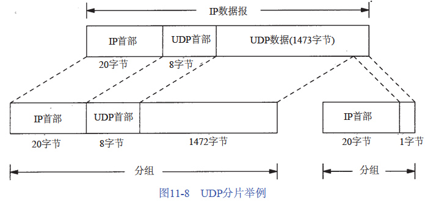
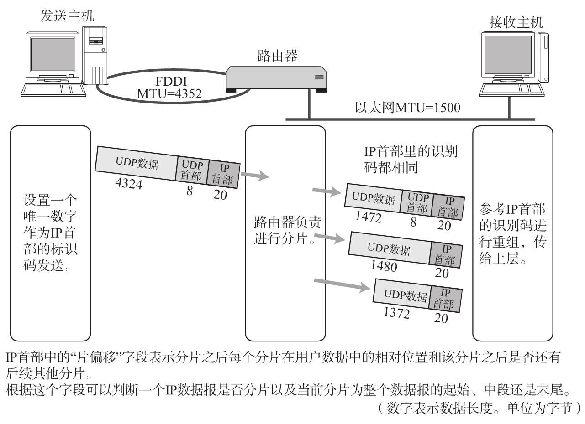

IP分片与组包

如果 IP层需要传送一个比MTU大的数据报，则IP层需要进行分片（fragmentation）即把数据报分成每一片都小于MTU的若干份。
> 以太网的MTU为1500字节，FDDI的MTU为4352字节，ATM的MTU为9180字节，如果需要通过以太网传输一个IP数据报大小为4342字节，则需要路由器将此IP数据报划分成了3个分片进行发送。

> IP数据报是指IP层端到端的传输单元（在分片之前和重新组装之后）

> 分组是指在IP层和链路层之间传送的数据单元。一个分组可以是一个完整的 IP数据报，也可以是IP数据报的一个分片。

由于IP层没有超时重传机制的 ，因此如果IP层对一个数据包进行了分片，则只要有一个分片丢失了就需要将所有的分片都要重传一遍（==代价大==）。因此IP分片会大大降低传输层传送数据的成功率。
