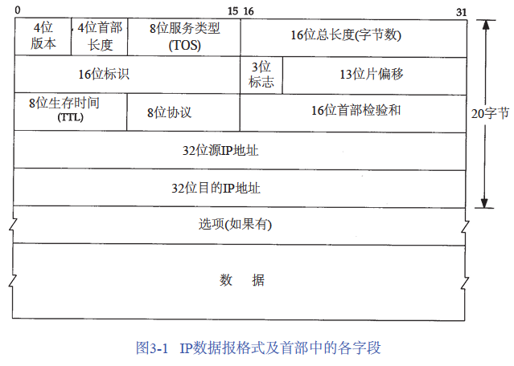
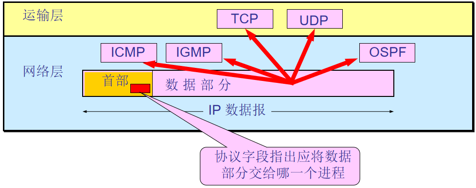
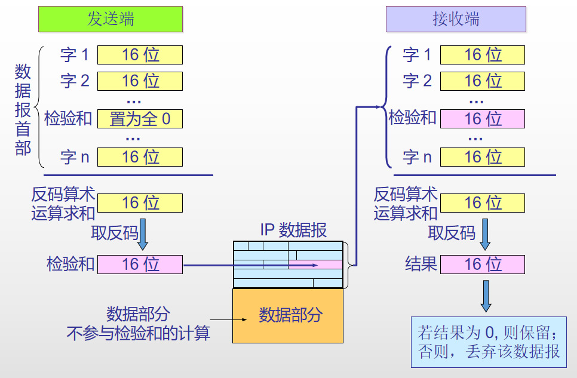
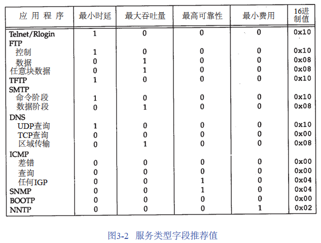

> IPv4首部共20字节。最高位在左边，记为0 bit；最低位在右边，记为31 bit，共32位。

协议版本：IPv4 为 4， IPv6 为 6

首部长度：用4 bit长度标示首部长度，1bit的标示数代表了首部是4个字节长，所以15对应60字节。

服务类型（TOS）字段：一个3 bit的优先权子字段（已被忽略），4 bit的TOS子字段 ，1 bit未用位但必须置0

> 4 bit的TOS分别代表：最小时延、最大吞吐量、最高可靠性和最小费用。4 bit中只能设置其中1 bit。如果所有4 bit均为0，那么就意味着是一般服务。

总长度字段：整个IP数据报的长度，以字节为单位。总长度字段 - 首部长度字段  =  数据内容的起始位置和长度。该字段长16个bit，因此IP数据包最大可以为2 ^ 16 -1 = 65535 字节

> 但大多数链路层不能携带655535字节长度的数据，需要将数据拆分为小于最小链路MTU数据报。
>  [[IP分片与组包]]

标识字段：唯一地标识主机发送的每一份数据报

标志 (flag)：占 3 位分别表示R、DF、MF。目前只有后两位有效

> **MF** (More Fragment)。MF = 1 表示后面“还有分片”。**MF** = 0 表示最后一个分片。
> **DF** (Don't Fragment) 。只有当 DF = 0 时才允许分片。

片偏移：本分片在原先数据报文中相对首位的偏移位。该字段的单位是8字节

生存期 （TTL，time-to-live）：用于设置数据报可以经过的最多路由器数。每经过一个路由器减一

协议字段：指出此数据报携带的数据使用何种协议，比如TCP、UDP

首部检验和字段：根据IP首部计算的检验和码。首先把检验和字段置为 0。然后，对首部中每个 16 bit 进行二进制反码求和，结果存在检验和字段中

TOS字段推荐值

#red 

[[Internet控制报文协议-ICMP]]