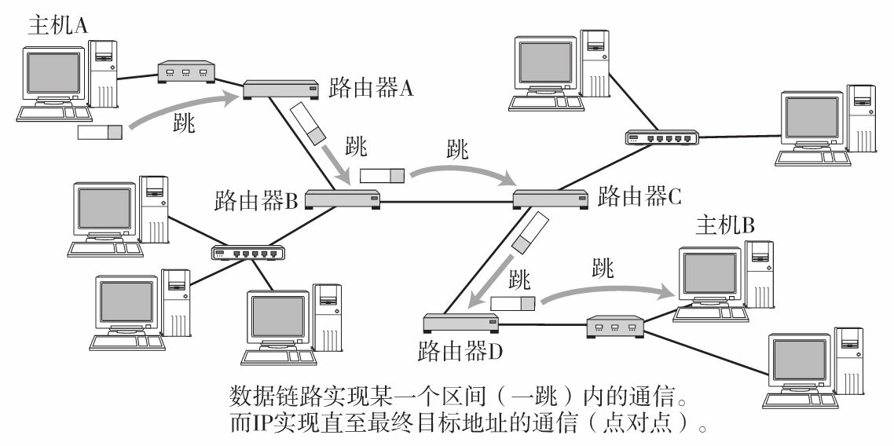

## IP路由选择

主机和路由器都使用路由表进行路由决策，路由的类型包括：特定主机型、特定网络型和默认型。大多数的主机和许多路由器对于非本地网络的数据报都使用默认的下一站路由器。

> IP路由选择是通过==逐跳==来实现的。一跳（1 Hop）指在以太网中从源MAC地址到目标MAC地址的传输帧区间。
> 
> 

## 路由分组转发流程

- 从数据报的首部提取目的主机的 IP 地址 D，得到目的网络地址 N。

> IP地址（IPv4地址）由“网络标识（网络地址）”和“主机标识（主机地址）”两部分组成
> 将计算机的十进制IP地址和子网掩码转换为二进制形式，然后执行与运算。 如果结果相同，则两台计算机属于同一网段。

- 若 N 就是与此路由器直接相连的某个网络地址，则进行直接交付；

- 若路由表中有目的地址为 D 的特定主机路由，则把数据报传送给表中所指明的下一跳路由器；

- 若路由表中有到达网络 N 的路由，则把数据报传送给路由表中所指明的下一跳路由器；

- 若路由表中有一个默认路由，则把数据报传送给路由表中所指明的默认路由器；

- 报告转发分组出错。

[[路由选择协议]]