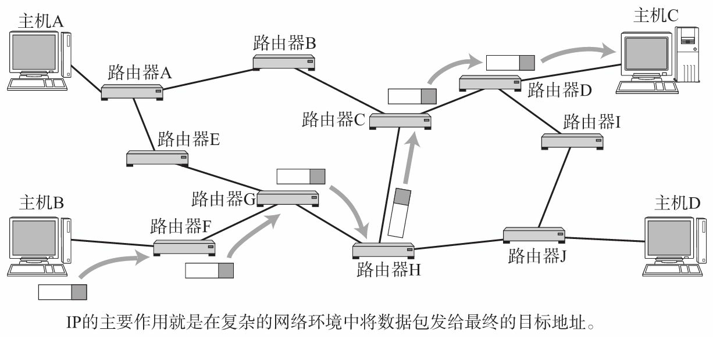
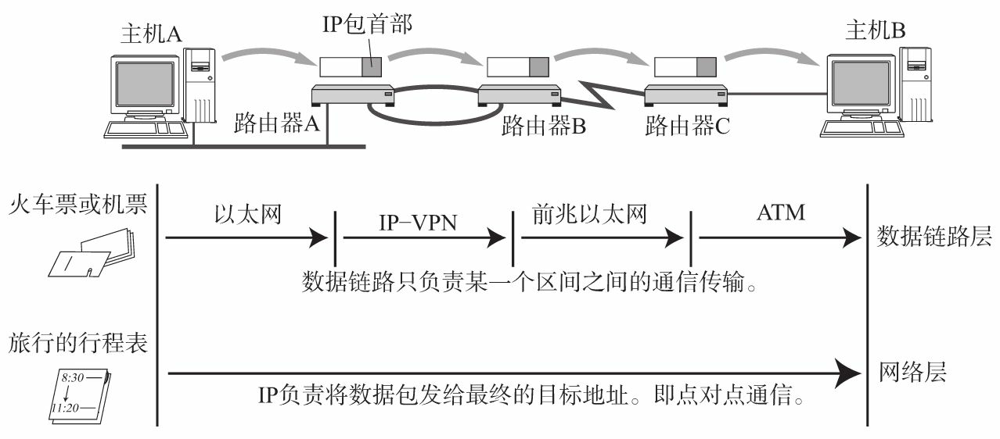

IP（Internet Protocol）:IP提供一种尽力而为、无连接的数据报交付服务。 TCP/IP协议族中的核心协议，所有TCP、UDP、ICMP、IGMP数据都通过IP数据报传输。

> 尽力而为：不保证IP数据报能成功达到目的地。
> 无连接：IP不维护网络单元中数据包相关的任何链接状态信息。每个数据报独立于其他数据报来处理。

IP协议主要作用为：IP寻址、路由（最终节点为止的转发）以及IP分包与组包。

[[Internet地址结构]]

[[IP数据报格式]]

[[IP路由]]

[[域名系统-DNS]]

[[传输控制协议-TCP]]

[[用户数据报文协议-UDP]]
