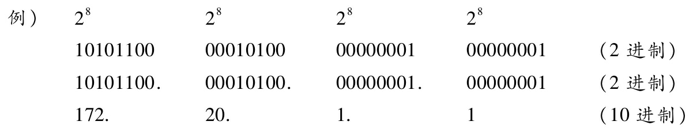
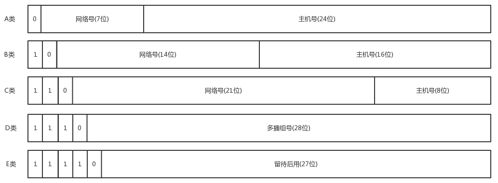
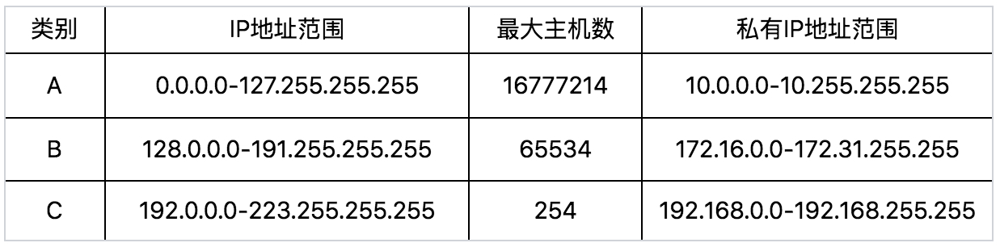

IP地址（IPv4地址）由“网络标识（网络地址）”和“主机标识（主机地址）”两部分组成，共32bit。每8位为一组，分成4组。

IP地址分为五个级别，分别为A类、B类、C类、D类、E类 

## A类地址
A类IP地址是首位以“0”开头的地址。从第1位到第8位为网络标识，
地址范围：1.0.0.1-126.255.255.255 (00000001.00000000.00000000.00000000~01111110.111111111.11111111.11111111，十进制1.0.0.0-126.255.255.255)
网络号范围： 1~126  （0000 0001 ~ 0111 1110）

## B类地址
B类IP地址是前两位为“10”的地址。从第1位到第16位为网络标识，
地址范围：128.1.0.1-191.255.255.255 
网络号范围：128.1 ~ 191.255（10000000 00000001 00000000 00000001 - 10111111 11111111 11111111 11111111） 

## C类地址
C类IP地址是前三位为“110”的地址。从第1位到第24位为网络标识
地址范围：192.0.1.1-223.255.255.254
网络号段范围：**192.0.1** ~ **223.255.255**

## D类地址
D类IP地址是前四位为“1110”的地址。从第1位到第32位为网络标识。 是多播地址。
地址范围：224.0.0.1-239.255.255.254

IP地址不够的解决方案：

[[无类型域间选路-CIDR]]

[[全局地址与私有地址-NAT]]

[[系统自动配置-DHCP]]