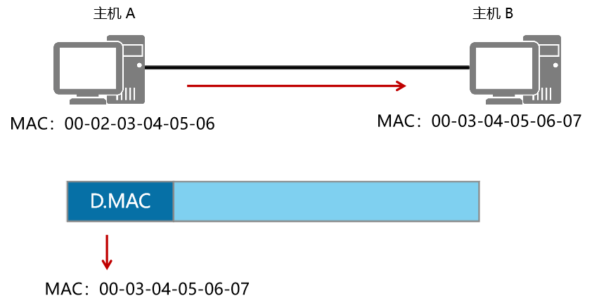
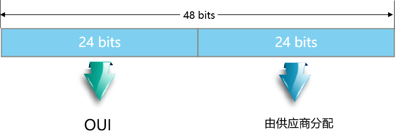

**数据链路层基于MAC地址进行帧的传输**

## 以太网的MAC地址

MAC地址由两部分组成，分别是供应商代码和序列号。
其中前24位代表该供应商代码，由IEEE管理和分配；
剩下的24位序列号由厂商自己分配。

**网络设备的MAC地址是全球唯一的，MAC地址长度为48比特，通常用十六进制表示**。

**MAC地址包含两部分**：
前24比特是组织唯一标识符（OUI，Organizationally Unique Identifier），由IEEE统一分配给设备制造商。
后24位序列号是厂商分配给每个产品的唯一数值，由各个厂商自行分配（这里所说的产品可以是网卡或者其他需要MAC地址的设备）。