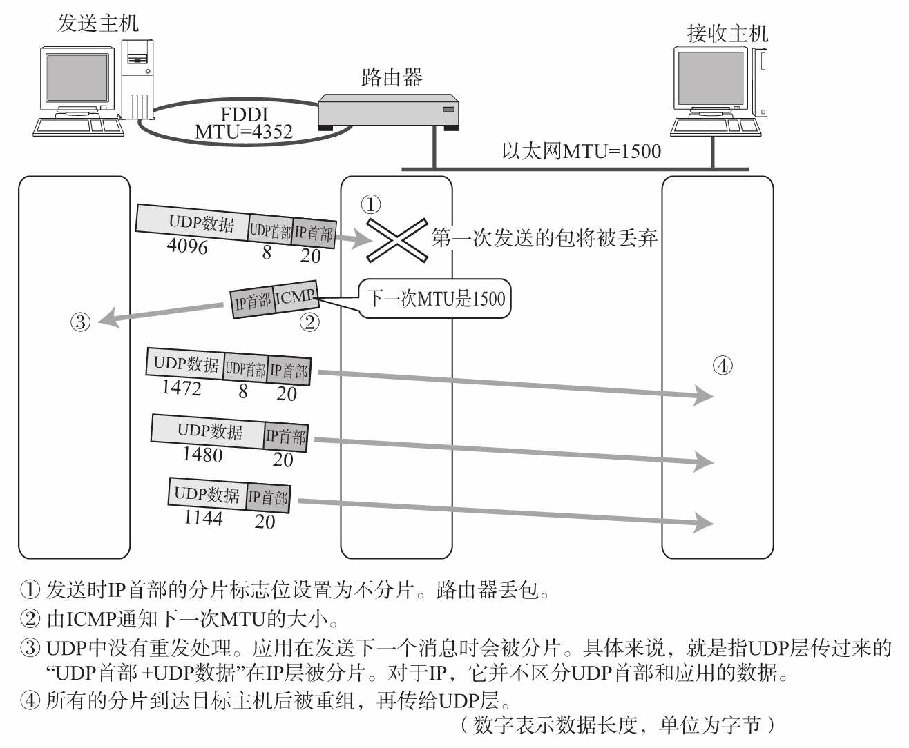

MTU：Maximum Transmission Unit，具体数据链路最大传输单位。比如太网的MTU为1500字节，FDDI太网的MTU为4352字节，ATM太网的MTU为9180字节， 802.3的MTU为1492字节。

路径MTU：两台通信主机路径中的最小MTU。具体值取决于当时选择的路由

路径MTU发现（Path MTU Discovery）：找到从发送端主机到接收端主机之间不需要分片时最大MTU的大小（最小的MTU）。

