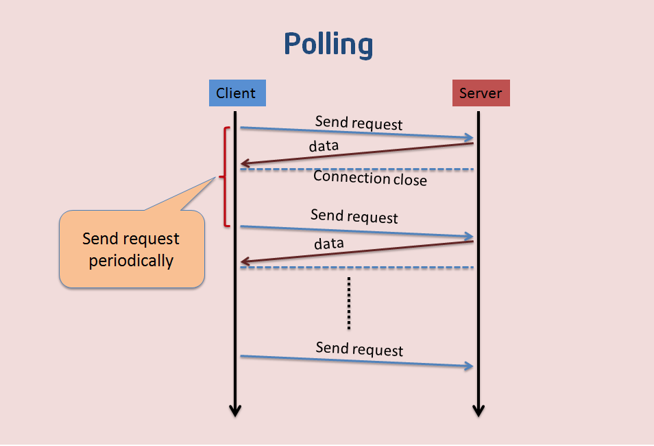
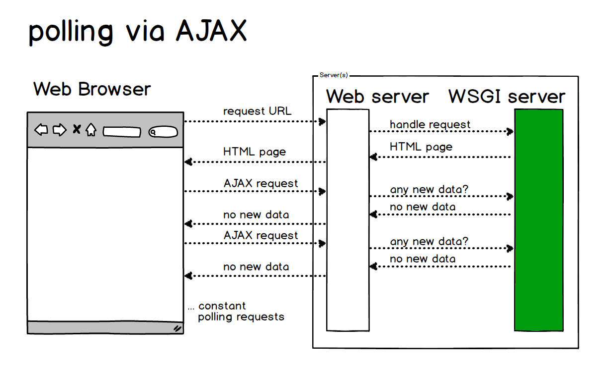
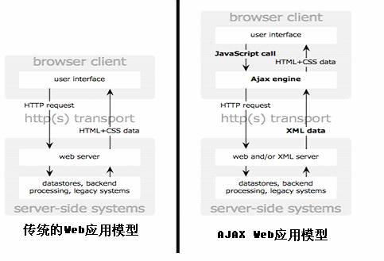
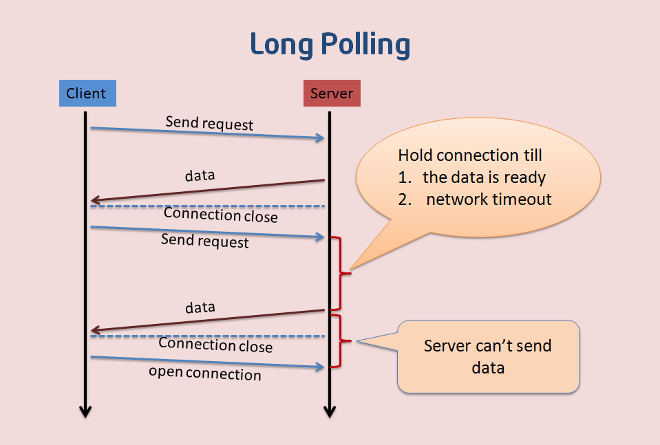
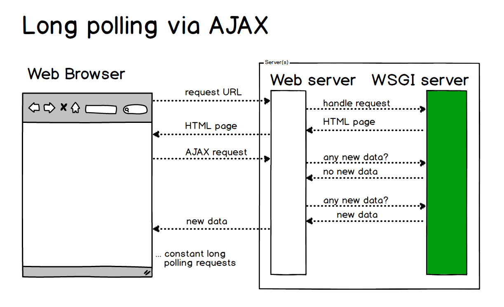
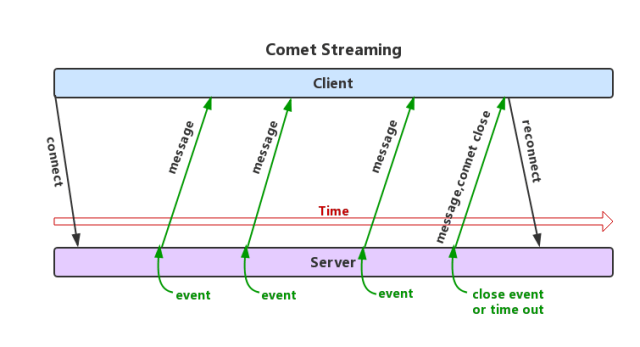
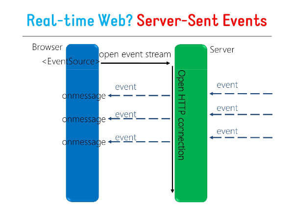
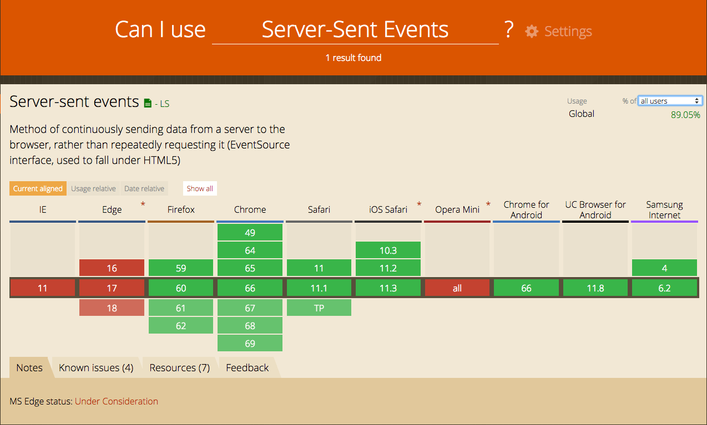
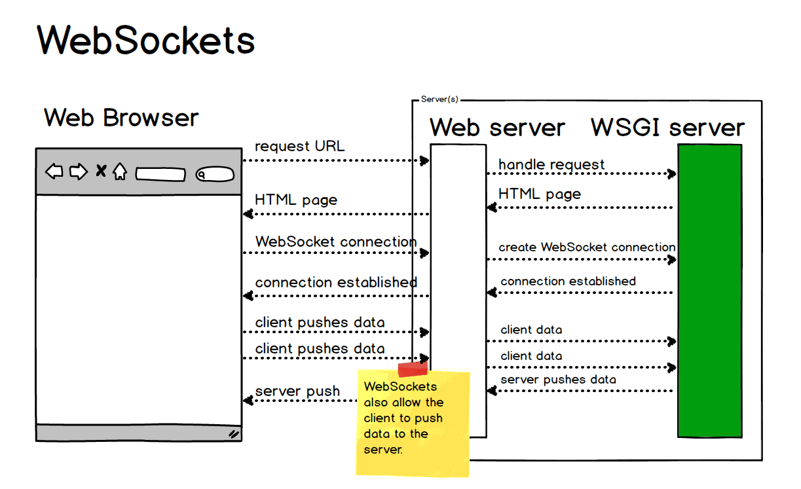
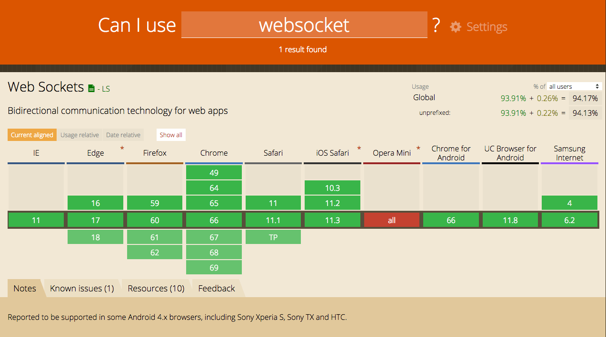

## 实时消息

### 短轮询



客户端每隔一段时间就向服务端发送请求进行轮询，尝试获取消息。每次发送请求都会有 HTTP 的 Header，会很耗流量，且消息实时性相对较差。这个阶段可以看到，一个 Request 对应一个 Response，一来一回一来一回。

#### AJAX JSONP Polling 实现短轮询

由于 HTTP 无法无限时长的保持连接，所以不能在服务器和 Web 浏览器之间频繁的长时间进行数据推送，所以 Web 应用通过通过频繁的异步 JavaScript
和 XML (AJAX) 请求来实现轮循。



优点：短连接，服务器处理简单，支持跨域、浏览器兼容性较好。

缺点：有一定延迟、服务器压力较大，浪费带宽流量、大部分是无效请求。

### 基于 HTTP 长连接的“服务器推”技术 （Comet Long polling）

Comet 简介

浏览器作为 Web 应用的前台，自身的处理功能比较有限。在 Web 应用中，浏览器的主要工作是发送请求、解析服务器返回的信息以不同的风格显示。AJAX
是浏览器技术发展的成果，通过在浏览器端发送异步请求，提高了单用户操作的响应性。现有 AJAX 技术的发展并不能解决在一个多用户的 Web
应用中，将更新的信息实时传送给客户端，从而用户可能在“过时”的信息下进行操作。而 AJAX 的应用又使后台数据更新更加频繁成为可能。

图 1. 传统的 Web 应用模型与基于 AJAX 的模型之比较





长轮询是对轮询的改进版，客户端发送 HTTP 请求给服务端，此时如果服务没有新的消息需要返回给客户端，服务端会持有此链接一段时间，直到有消息或者超时才会返回给客户端。消息返回后，客户端再次建立连接，如此反复。这种做法在一定程度上减小了网络带宽和 CPU 利用率等问题。

弊端：实时性不高，宽带利用率较低。

#### AJAX 长轮询（XHR 长轮询）

客户端打开一个到服务器端的 AJAX 请求，然后等待响应，服务器端需要一些特定的功能来允许请求被挂起，只要一有事件发生，服务器端就会在挂起的请求中送回响应并关闭该请求。客户端在处理完服务器返回的信息后，再次发出请求，重新建立连接，如此循环。



AJAX 的出现使得 JavaScript 可以调用 XMLHttpRequest 对象发出 HTTP 请求，JavaScript 响应处理函数根据服务器返回的信息对 HTML 页面的显示进行更新。使用 AJAX 实现“服务器推” 与传统的 AJAX 应用不同之处在于：

-   服务器端会阻塞请求直到有数据传递或超时才返回。
-   客户端 JavaScript 响应处理函数会在处理完服务器返回的信息后，再次发出请求，重新建立连接。
-   当客户端处理接收的数据、重新建立连接时，服务器端可能有新的数据到达；这些信息会被服务器端保存直到客户端重新建立连接，客户端会一次把当前服务器端所有的信息取回。

### 基于流（Comet Streaming）

#### Iframe Streaming

iframe 流方式是在页面中插入一个隐藏的 iframe，利用其 src 属性在服务器和客户端之间创建一条长链接，服务器向 iframe 传输数据（通常是
HTML，内有负责插入信息的 JavaScript），来实时更新页面。iframe 流方式的优点是浏览器兼容好。



使用 iframe 请求一个长连接有一个很明显的不足之处：IE、Morzilla Firefox 下端的进度栏都会显示加载没有完成，而且 IE 上方的图标会不停的转动，表示加载正在进行。

优点：实现简单，在所有支持 iframe 的浏览器上都可用、客户端一次连接、服务器多次推送。
缺点：无法准确知道连接状态，IE浏览器在 iframe 请求期间，浏览器 title 一直处于加载状态，底部状态栏也显示正在加载，用户体验不好（htmlfile 通过
ActiveXObject 动态写入内存可以解决此问题）。

#### AJAX multipart streaming（XHR Streaming）

实现思路：浏览器必须支持 multi-part 标志，客户端通过 AJAX 发出请求 Request，服务器保持住这个连接，然后可以通过 HTTP1.1 的 chunked encoding 机制（分块传输编码）不断 push 数据给客户端,直到 timeout 或者手动断开连接。

优点：客户端一次连接，服务器数据可多次推送。
缺点：并非所有的浏览器都支持 multi-part 标志。

#### Flash Socket（Flash Streaming）

实现思路：在页面中内嵌入一个使用了 Socket 类的 Flash 程序，JavaScript 通过调用此 Flash 程序提供的 Socket 接口与服务器端的 Socket 接口进行通信，JavaScript 通过Flash Socket 接收到服务器端传送的数据。

优点：实现真正的即时通信，而不是伪即时。
缺点：客户端必须安装 Flash 插件；非 HTTP 协议，无法自动穿越防火墙。

### Server-Sent Events

服务器发送事件（SSE）也是 HTML5 公布的一种服务器向浏览器客户端发起数据传输的技术。一旦创建了初始连接，事件流将保持打开状态，直到客户端关闭。SSE 就是利用服务器向客户端声明，接下来要发送的是流信息（streaming），会连续不断地发送过来。此时客户端不会关闭连接，会一直等着服务器发过来的新的数据流，可以类比视频流。SSE 就是利用这种机制，使用流信息向浏览器推送信息。SSE 是单向通道，只能服务器向浏览器发送，因为流信息本质上就是下载。服务器向浏览器发送的 SSE 数据，必须是 UTF-8 编码的文本，具有如下的 HTTP 头信息。

```
Content-Type: text/event-stream
Cache-Control: no-cache
Connection: keep-alive

```




优点：适用于更新频繁、低延迟并且数据都是从服务端发到客户端。
缺点：浏览器兼容难度高。



总结

短轮询效率低，非常浪费资源（网络带宽和计算资源）。有一定延迟、服务器压力较大，并且大部分是无效请求。
长轮询虽然省去了大量无效请求，减少了服务器压力和一定的网络带宽的占用，但是还是需要保持大量的连接。
最后到了基于流的方式，在服务器往客户端推送，这个方向的流实时性比较好。但是依旧是单向的，客户端请求服务器依然还需要一次HTTP 请求。

SSE对比websocket
-   SSE 使用 HTTP 协议，现有的服务器软件都支持。WebSocket 是一个独立协议。
-   SSE 属于轻量级，使用简单；WebSocket 协议相对复杂。
-   SSE 默认支持断线重连，WebSocket 需要自己实现。
-   SSE 一般只用来传送文本，二进制数据需要编码后传送，WebSocket 默认支持传送二进制数据。
-   SSE 支持自定义发送的消息类型。

#### 客户端示例

```js
if(typeof(EventSource)!=="undefined") {
	 var source=new EventSource("demo_sse");
	 source.onmessage=function(event) {
	 	document.getElementById("result").innerHTML+=event.data + "<br>";
	 };
 } else {
	 document.getElementById("result").innerHTML="抱歉，你的浏览器不支持 server-sent 事件...";
 }
```
#### 服务端示例

```java 
/** 
* import org.springframework.web.servlet.mvc.method.annotation.SseEmitter; 
* 客户端先调用push接口进入监听 * @param payRecordId 
* @return 
*/ 
@GetMapping("/push") 
public **SseEmitter** push(@RequestParam Long payRecordId){
	final SseEmitter emitter = new SseEmitter(); 
	try {
	 	payCompletedListener.addSseEmitters(payRecordId,emitter); 
	}catch (Exception e){ 
		emitter.completeWithError(e); 
	} 
	return emitter; 
} 
```

### WebSocket

WebSocket
协议在2008年诞生，2011年成为国际标准。其最大特点就是，服务器可以主动向客户端推送信息，客户端也可以主动向服务器发送信息，是真正的双向平等对话，属于[服务器推送技术](https://en.wikipedia.org/wiki/Push_technology)的一种。




其他特点包括：
（1）建立在 TCP 协议之上，服务器端的实现比较容易。
（2）与 HTTP 协议有着良好的兼容性。默认端口也是80和443，并且握手阶段采用 HTTP 协议，因此握手时不容易屏蔽，能通过各种 HTTP 代理服务器。
（3）数据格式比较轻量，性能开销小，通信高效。
（4）可以发送文本，也可以发送二进制数据。
（5）没有同源限制，客户端可以与任意服务器通信。
（6）协议标识符是ws（如果加密，则为wss），服务器网址就是 URL。




#### 客户端示例

```java
var ws = new WebSocket("wss://echo.websocket.org");

ws.onopen = function(evt) { 
  console.log("Connection open ..."); 
  ws.send("Hello WebSockets!");
};

ws.onmessage = function(evt) {
  console.log( "Received Message: " + evt.data);
  ws.close();
};

ws.onclose = function(evt) {
  console.log("Connection closed.");
};      

```


#### 服务端示例

```java
package com.learn.springcloud.websocket.controller;

import com.learn.springcloud.websocket.entity.ReceiveMessage;
import org.springframework.beans.factory.annotation.Autowired;
import org.springframework.messaging.handler.annotation.MessageMapping;
import org.springframework.messaging.simp.SimpMessagingTemplate;
import org.springframework.stereotype.Controller;


/**
 * websocket 消息的两种方式：点对点推送，主题订阅
 * http://localhost:6032/topic.html
 * http://localhost:6032/queue.html
 * 服务端推送方案相对客户端轮训可以解决当服务端没有消息时，客户端建立没有必要的链接问题
 */
@Controller
public class SubController {
    @Autowired
    public SimpMessagingTemplate simpMessagingTemplate;


    /**
     * 消息订阅模式，即一人推送多人监听
     *  消息发送端通过地址subscribe 发送消息，
     *  消息订阅端通过 /topic/getResponse 接收消息
     * @param rm
     */
    @MessageMapping("/subscribe")
    public void subscribe(ReceiveMessage rm) {
        for (int i = 1; i <= 20; i++) {
            //广播使用convertAndSend方法，第一个参数为目的地，和js中订阅的目的地要一致
            simpMessagingTemplate.convertAndSend("/topic/getResponse",
                    rm.getName().concat("-").concat(String.valueOf(System.currentTimeMillis())));
            try {
                Thread.sleep(1000);
            } catch (InterruptedException e) {
                e.printStackTrace();
            }
        }

    }

    /**
     * 消息点对点推送
     * 消息发送端通过 地址 /queue 发送消息，
     * 消息接收端通过  /user/zhangsan/message 接收消息
     * @param rm
     */
    @MessageMapping("/queue")
    public void queuw(ReceiveMessage rm) {
        for (int i = 1; i <= 20; i++) {
            /*广播使用convertAndSendToUser方法，第一个参数为用户id，此时js中的订阅地址为
            "/user/" + 用户Id + "/message",其中"/user"是固定的*/
            simpMessagingTemplate.convertAndSendToUser("zhangsan", "/message", rm.getName());
            try {
                Thread.sleep(1000);
            } catch (InterruptedException e) {
                e.printStackTrace();
            }
        }

    }
}

```


开启stomp协议

```java
/**
 * 注解开启STOMP协议来传输基于代理的消息，此时控制器支持使用@MessageMapping
 */
@Configuration
@EnableWebSocketMessageBroker
public class WebSocketConfig implements WebSocketMessageBrokerConfigurer {

    @Override
    public void configureMessageBroker(MessageBrokerRegistry config) {
        //topic用来广播，user用来实现p2p
        config.enableSimpleBroker("/topic","/user");
        // config.setApplicationDestinationPrefixes("/app");
    }

    @Override
    public void registerStompEndpoints(StompEndpointRegistry registry) {
        //注册两个STOMP的endpoint，分别用于广播和点对点
        registry.addEndpoint("/webServer").withSockJS();
        registry.addEndpoint("/queueServer").withSockJS();
    }

}

```


#### WebSocket请求头

首先，WebSocket连接必须由浏览器发起，因为请求协议是一个标准的HTTP请求，格式如下：

```
GET ws://localhost:3000/ws/chat HTTP/1.1
Host: localhost
Upgrade: websocket
Connection: Upgrade
Origin: http://localhost:3000
Sec-WebSocket-Key: client-random-string
Sec-WebSocket-Version: 13

```


该请求和普通的HTTP请求有几点不同：
GET请求的地址不是类似/path/，而是以ws://开头的地址；
请求头Upgrade: websocket和Connection: Upgrade表示这个连接将要被转换为WebSocket连接；
Sec-WebSocket-Key是用于标识这个连接，并非用于加密数据；
Sec-WebSocket-Version指定了WebSocket的协议版本。
随后，服务器如果接受该请求，就会返回如下响应：

```
HTTP/1.1 101 Switching Protocols
Upgrade: websocket
Connection: Upgrade
Sec-WebSocket-Accept: server-random-string

```

该响应代码101表示本次连接的HTTP协议即将被更改，更改后的协议就是Upgrade: websocket指定的WebSocket协议。
版本号和子协议规定了双方能理解的数据格式，以及是否支持压缩等等。如果仅使用WebSocket的API，就不需要关心这些。

参考：

<https://github.com/halfrost/Halfrost-Field>
