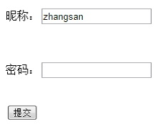
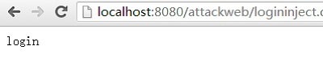
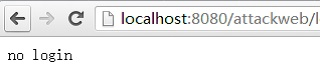

### SQL注入攻击

SQL注入就是通过把SQL命令伪装成正常的HTTP请求参数，传递到服务端，欺骗服务器最终执行恶意的SQL命令，达到入侵目的。攻击者可以利用SQL注入漏洞，查询非授权信息，修改数据库服务器的数据，改变表结构，甚至是获取服务器root权限。总而言之，SQL注入漏洞的危害极大。当前涉及到大批量数据泄露的攻击事件，大部分都是通过利用SQL注入来实施的。

假设有个网站的登录页面，如下所示：



假设用户输入nick为zhangsan，密码为password1，则验证通过，显示用户登录：



否则，显示用户没有登录：



```java
	...{
	Connection conn = getConnection();
	String sql = "select * from hhuser where nick = '" + nickname +
	"'" + " and passwords = '" + password + "'";
	Statement st = (Statement) conn.createStatement();
	ResultSet rs = st.executeQuery(sql);
	List<UserInfo> userInfoList = new ArrayList<UserInfo>();
	while (rs.next()) {
		UserInfo userinfo = new UserInfo();
		userinfo.setUserid(rs.getLong("userid"));
		userinfo.setPasswords(rs.getString("passwords"));
		userinfo.setNick(rs.getString("nick"));
		userinfo.setAge(rs.getInt("age"));
		userinfo.setAddress(rs.getString("address"));}
		userInfoList.add(userinfo);

	}
```
当用户输入nick为zhangsan，密码为' or
'1'='1的时候，意想不到的事情出现了，页面显示为login状态：


以上便是一次简单的、典型的SQL注入攻击。当然，SQL注入的危害不仅如此，假设用户输入用户名zhangsan，在密码框输入'
;drop table aaa;--， 会发生什么呢？

SQL注入的防御

1. 使用预编译语句

预编译语句PreparedStatement是java.sql中的一个接口，继承自Statement接口。通过Statement对象执行SQL语句时，需要将SQL语句发送给DBMS，由DBMS先进行编译后再执行。而预编译语句和Statement不同，在创建PreparedStatement对象时就指定了SQL语句，该语句立即发送给DBMS进行编译，当该编译语句需要被执行时，DBMS直接运行编译后的SQL语句，而不需要像其他SQL语句那样首先将其编译。

前面介绍过，引发SQL注入的根本原因是恶意用户将SQL指令伪装成参数传递到后端数据库执行，作为一种更为安全的动态字符串的构建方法，预编译语句使用参数占位符来替代需要动态传入的参数，这样攻击者无法改变SQL语句的结构，SQL语句的语义不会发生改变，即便用户传入类似于前面'
or '1'='1这样的字符串，数据库也会将其作为普通的字符串来处理。

2. 使用ORM框架

由上文可见，防止SQL注入的关键在于对一些关键字符进行转义，而常见的一些ORM框架，如ibatis、hibernate等，都支持对相应的关键字或者特殊符号进行转义，可以通过简单的配置，很好的预防SQL注入漏洞。

Ibatis的insert语句配置：

```xml
<insert id="insert" parameterClass="userDO">
insert into users(gmt_create,gmt_modified,userid,user_nick,address,age,sex)
values(now(),now(),#userId#,#userNick#,#address#,#age#,#sex#)
</insert>
```

通过#符号配置的变量，ibatis能够对输入变量中的关键字进行转义，防止SQL注入攻击。

3.避免密码明文存放

对存储的密码进行单向Hash，如使用MD5对密码进行摘要，而非直接存储明文密码，这样的好处就是万一用户信息泄露，即圈内所说的被“拖库”，黑客无法直接获取用户密码，而只能得到一串跟密码相差十万八千里的Hash码。

4.处理好相应的异常

后台的系统异常，很可能包含了一些如服务器版本、数据库版本、编程语言等等的信息，甚至是数据库连接的地址及用户名密码，攻击者可以按图索骥，找到对应版本的服务器漏洞或者数据库漏洞进行攻击，因此，必须要处理好后台的系统异常，重定向到相应的错误处理页面，而不是任由其直接输出到页面上。