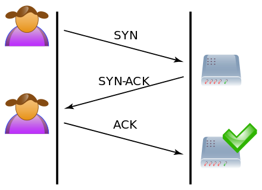
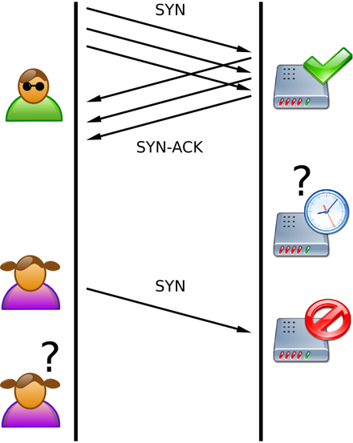

#### SYN Flood

SYN Flood是种典型的DoS (Denial of Service，拒绝服务) 攻击。效果就是服务器TCP连接资源耗尽，停止响应正常的TCP连接请求。要明白它的攻击原理，还得从TCP协议连接建立的过程开始说起，TCP协议与UDP协议不同，TCP是基于连接的协议，也就是说，在进行TCP协议通讯之前，必须先建立基于TCP协议的一个连接，连接建立的过程如下图所示，左边是A，右边是B：

A首先发送SYN（Synchronization）消息给B，要求B做好接收数据的准备；B收到后反馈SYN-ACK（Synchronization-Acknowledgement）消息给A，这个消息的目的有两个：(1) 向A确认已做好接收数据的准备，(2) 同时要求A也做好接收数据的准备，此时B已向A确认好接收状态，并等待A的确认，连接处于半开状态（Half-Open），顾名思义只开了一半；A收到后再次发送 ACK(Acknowledgement)消息给B，向B确认也做好了接收数据的准备，至此三次握手完成，“连接”就建立了，实际上只是双方都按对方的要求进入了可以接收消息的状态。

以上讨论的是在双方诚实可信，网络正常的理想状况下建立连接。但实际情况是，网络可能不稳定会丢包，使握手消息不能抵达对方，也可能是对方故意不按规矩来，故意延迟或不发送握手确认消息。假设B通过某TCP端口提供服务，B在收到A的SYN消息时，积极的反馈了SYN-ACK消息，使连接进入半开状态，因为B不确定自己发给A的SYN-ACK消息或A反馈的ACK消息是否会丢在半路，所以会给每个待完成的半开连接都设一个Timer，如果超过时间还没有收到A的ACK消息，则重新发送一次SYN-ACK消息给A，直到重试超过一定次数时才会放弃。

做好人是要付出代价的，B为帮助A能顺利连接，需要分配内核资源维护半开连接，那么当B面临海量的大忽悠A时[1]，如上图所示，SYN
Flood攻击就形成了。攻击方A可以控制肉鸡向B发送大量SYN消息但不响应ACK消息，或者干脆伪造SYN消息中的Source
IP，使B反馈的SYN-ACK消息石沉大海[2]，导致B被大量注定不能完成的半开连接占据，直到资源耗尽，停止响应正常的连接请求

SYN Flood的防御

SYN Cache的出发点主要是针对“鸠占鹊巢”问题，基本原理如下：构造一个全局的Hash Table，用来缓存系统当前所有的半开连接信息，连接成功则从Cache中清除相关信息；Hash Table中每个桶（bucket）的容量大小也有限制，当桶“满”时做除旧迎新操作。当B收到一个SYN消息后，会将半开连接信息加入到Hash Table中，其中key的生成很关键，既要用到SYN消息中包含的信息（如：Source IP，Port等）又要做到很难被攻击者猜到，一般会通过一个秘密的函数生成，这样所有的半开连接无论好坏，都看似随机地被平均分配到了不同的“桶”中，使攻击难度大增，因为为达到DoS效果，攻击者需要使每个桶都达到填满状态，并且还要有足够快的“填桶”速度，使得正常的半开连接在还未完成建立前就被踢出桶，这样的攻击行为估计在达到目的前早就暴露了。