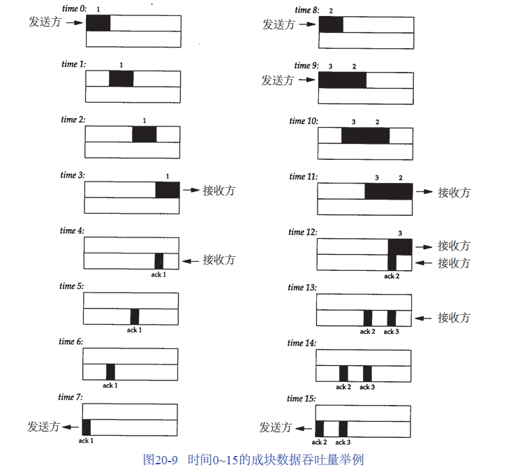
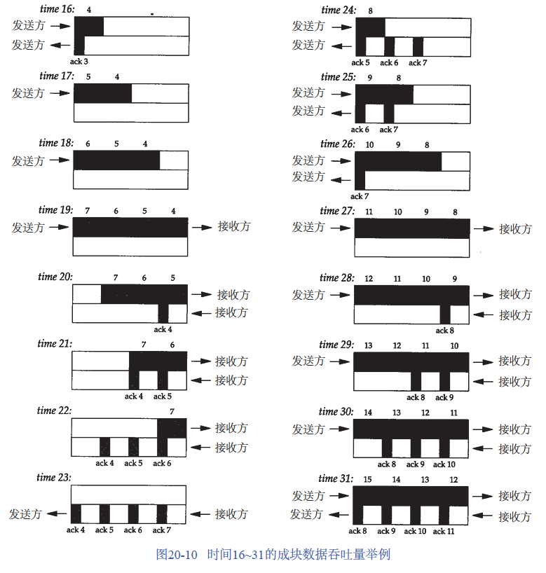

成块数据的吞吐量

窗口大小、窗口流量控制以及慢启动对传输成块数据的TCP连接的吞吐量的相互作用。

在时间0，发送方发送了一个报文段。由于发送方处于慢启动中（其拥塞窗口为1个报文段），因此在继续发送以前它必须等待该数据段的确认。

在时间1,2和3，报文段从左向右移动一个时间单元。

在时间4接收方读取这个报文段并产生确认。

经过时间5、6和7，ACK移动到左边的发送方。

我们有了一个8个时间单元的往返时间RTT（Round-Trip Time）。

当发送方收到ACK后，在时间8和9发送两个报文段（标记为2和3）。此时它的拥塞窗口为2个报文段。这两个报文段向右传送到接收方

在时间12和13接收方产生两个ACK。这两个返回到发送方的ACK之间的间隔与报文段之间的间隔一致，被称为TCP的自计时(self-clocking)行为。（实际中，返回路径上的排队会改变ACK的到达率）。

>上图使用离散的时间单元。
>
>每个粗箭头线的上半部分显示的是从左到右的携带数据的报文段，标记为1,2,3,等等。
>
>在粗线箭头下面表示的是反向传输的ACK。我们把ACK用细箭头线表示，并标注了被确认的报文段号。

2个ACK的到达使得拥塞窗口从2个报文段增加为4个，而这4个报文段在时间16-19时被发送。

第1个ACK在时间23到达。

4个ACK的到达使得拥塞窗口从4个报文段增加为8个，并在时间24-31发送8个报文段。

在时间31及其后续时间，发送方和接收方之间的管道(pipe)被填满。此时不论拥塞窗口和通告窗口是多少，它都不能再容纳更多的数据。每当接收方在某一个时间单位从网络上移去一个报文段，发送方就再发送一个报文段到网络上

带宽时延乘积（通道容量）：capacity(bit) = bandwidth(b/s) * round - triptime(s)

