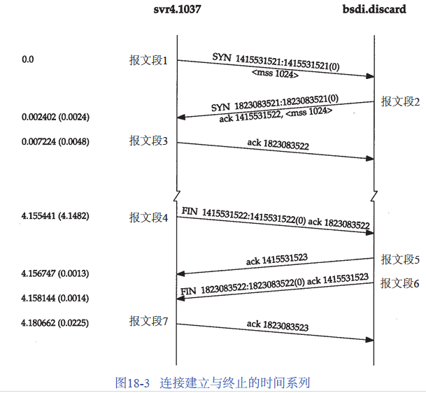
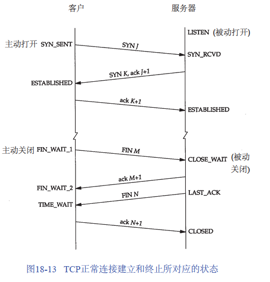
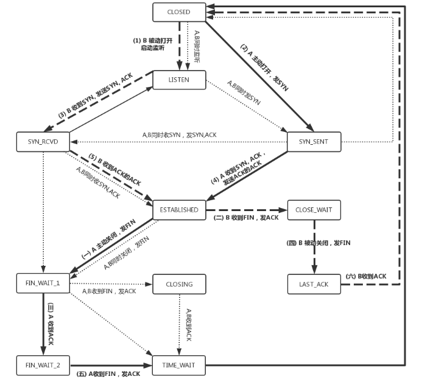

### TCP的三次握手

假设客户端`svr4.1037`向`bsd.discard` 建立一个tcp连接，其过程如下：

1. 客户端请求连接，客户端发送连接请求报文段，将SYN位置为1，Sequence Number 即ISN为1415531521。客户端进入`SYN_SEND`状态
2. 服务端确认连接，主要包含以下两个工作
	- 服务器收到客户端的SYN报文段，设置Acknowledgment Number为1415531522(Sequence Number+1)对SYN报文段进行确认；
	- 服务器端发送SYN请求信息，将SYN位置为1，Sequence Number为1823083521
	- 将以上两信息组装成SYN+ACK报文段并发送给客户端。服务器进入`SYN_RECV`状态；
3. 客户端确认链接，客户端收到服务器的SYN+ACK报文段。然后将`Acknowledgment Number`设置为1823083522(Sequence Number+1)，向服务器发送ACK报文段。
报文段发送完毕以后，客户端和服务器端都进入`ESTABLISHED`状态，完成TCP三次握手。

> TCP建立连接需要3次握手的目的是为了解决“==网络中存在延迟的重复分组==”的问题。即如果只存在两次握手则会出现如下情况：
> client发出的第一个连接请求报文段并没有丢失，而是在某个网络结点长时间的滞留了，以致延误到连接释放以后的某个时间才到达server。此时客户端因长时间没有收到服务端的响应而放弃该请求。
> 当server收到此失效的连接请求报文段后，就误认为是client再次发出的一个新的连接请求。于是就向client发出确认报文段，同意建立连接。
> 由于现在client并没有发出建立连接的请求，因此不会理睬server的确认，也不会向server发送数据。但server却以为新的运连接已经建立，并一直等待client发来数据。从而导致server端资源浪费

## TCP的四次挥手

由于TCP连接是全双工，因此每个方向必须单独地进行关闭。也就是说当一方完成它的数据发送任务后就能发送一个FIN来终止这个方向连接。

1. 主机1（可以是客户端或服务器端），设置Sequence Number和Acknowledgment Number，向主机2发送一个FIN报文段；主机1进入`FIN_WAIT_1`状态；
1. 主机2收到了主机1发送的FIN报文段（进入`CLOSE_WAIT` 状态）。然后向主机1返回一个ACK报文段，Acknowledgment Number为Sequence Number加1；主机1收到`ACK`消息后进入`FIN_WAIT_2`状态；
1. 主机2向主机1发送FIN报文段，请求关闭连接。主机2进入`LAST_ACK`状态；
1. 主机1收到主机2发送的FIN报文段，进入`TIME_WAIT`状态，并向主机2发送ACK报文段；主机2收到主机1的ACK报文段以后关闭连接；主机1等待`2MSL`后关闭连接。

> 报文段最大生存时间MSL(Maximum Segment Lifetime)：报文段被丢弃前在网络内的最长时间。
> `TIME_WAIT`状态也称为2MSL等待状态。2MSL 是因为主机2（被动关闭方）向主机1（主动关闭方）发送FIN 消息后，达到一个MSL没有收到消息，就会再次向主机1发送FIN消息
> 如果被动关闭的方没有发送FIN给主动关闭的方，则被动关闭的方的状态将一直处于`CLOASE_WAIT`，而主动关闭方的状态则一直处于`FIN_WAIT_2`

> 对每个连接，TCP管理4个不同的定时器。
> 1. 重传定时器使用于当希望收到另一端的确认。如拥塞避免。
> 2. 坚持(persist)定时器使窗口大小信息保持不断流动，即使另一端关闭了其接收窗口。
> 3. 保活(keepalive)定时器可检测到一个空闲连接的另一端何时崩溃或重启。
> 4. 2MSL定时器测量一个连接处于TIME_WAIT状态的时间。

半连接：主动关闭方在结束它的**发送后**还能接收来自被动关闭方数据。
半打开（Half - Open）的连接：连接双方中的一方已经关闭或异常终止而另一方却还不知道。

> 阿拉伯数字的序号是连接过程中的顺序。大写中文数字的序号是连接断开过程中的顺序。CLOSED状态不是一个真正的状态，而是一个理想假想起点和终点。
> 粗的<u>实线</u>箭头表示正常的客户端状态变迁，粗的<u>虚线</u>箭头表示正常的服务器状态变迁。
> 两个导致进入ESTABLISHED 状态的变迁对应<u>打开一个连接</u>，两个导致从ESTABLISHED 状态离开的变迁对应关<u>闭一个连接</u>。

[[Linux的TCP连接建立]]

https://github.com/JeffyLu/JeffyLu.github.io/issues/22

一个数据包在网络中的心路历程，回答当键入网址后，到网页显示，其间发生了什么
https://mp.weixin.qq.com/s/iSZp41SRmh5b2bXIvzemIw

https://mp.weixin.qq.com/s/Tc09ovdNacOtnMOMeRc_uA
https://mp.weixin.qq.com/s?__biz=MzUxODAzNDg4NQ==&mid=2247483989&idx=1&sn=7e2ed852770743d3955ef9d5561fcef3&scene=21#wechat_redirect
https://mp.weixin.qq.com/s?__biz=MzUxODAzNDg4NQ==&mid=2247483971&idx=1&sn=8f2d5dae3d95efc446061b352c8e9961&scene=21#wechat_redirect

https://github.com/JeffyLu/JeffyLu.github.io/issues/22

https://github.com/jawil/blog/issues/14