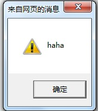

### XSS攻击

XSS攻击的全称是跨站脚本攻击(Cross Site Scripting)，为不跟层叠样式表(Cascading Style Sheets,CSS) 的缩写混淆，故将跨站脚本攻击缩写为XSS,是WEB应用程序中最常见到的攻击手段之一。

跨站脚本攻击指的是攻击者在网页中嵌入恶意脚本程序。当用户打开该网页时，脚本程序便开始在客户端的浏览器上执行，以盗取客户端cookie、盗取用户名密码、下载执行病毒木马程序甚至是获取客户端admin权限等等。



```
<input type="text" name="nick" value="xiaomao">
<input type="text" name="nick" value=""/>
<script>alert("haha")</script><!-" />
```
还有一种场景，用户在表单上输入一段数据后，提交给服务端进行持久化，其他页面上需要从服务端将数据取出来展示。还是使用之前那个表单nick，用户输入昵称之后，服务端会将nick保存，并在新的页面展现给用户，当普通用户正常输入zhangsan，页面会显示用户的nick为zhangsan：

<body>
zhangsan
</body>
但如果用户输入的不是一段正常的nick字符串，而是

<script>alert("haha")</script>，服务端会将这段脚本保存起来，当有用户查看该页面时，页面会出现如下代码：

<body> <script>alert("haha")</script></body>

XSS防御

XSS之所以会发生，是因为用户输入的数据变成了代码。因此，我们需要对用户输入的数据进行HTML转义处理，将其中的“尖括号”、“单引号”、“引号”
之类的特殊字符进行转义编码。

| HTML字符 | HTML转义后的字符 |
|----------|------------------|
| <       | &lt;            |
| >       | &gt;            |
| ‘        | &amp;           |


