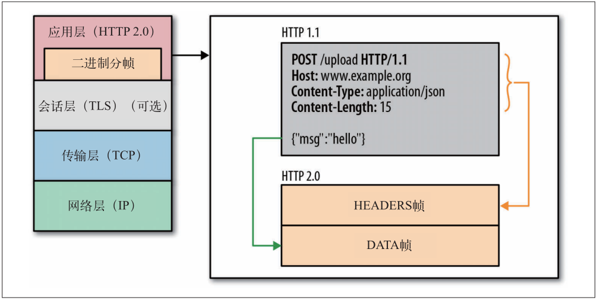
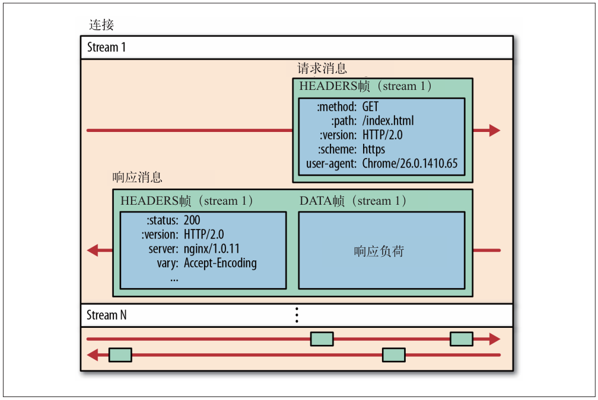
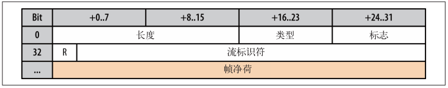
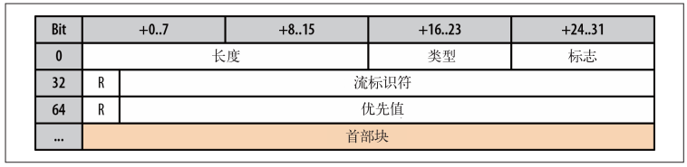
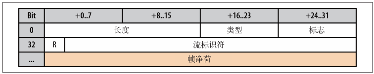
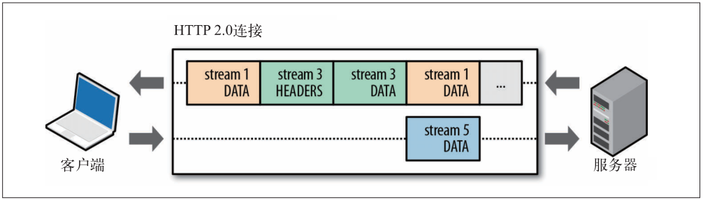
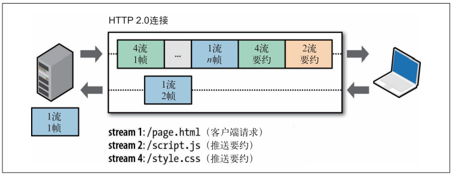
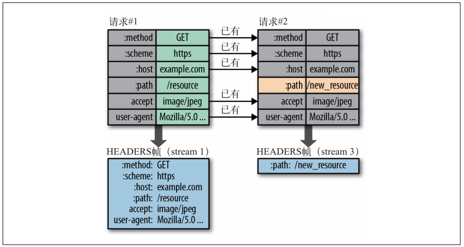
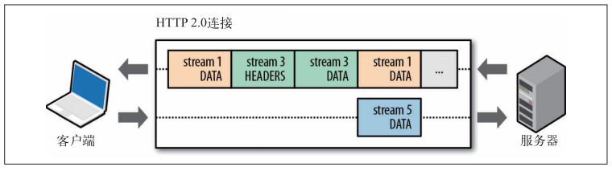

HTTP 2.0是在SPDY（An experimental protocol for a faster web, The Chromium Projects）基础上形成的下一代互联网通信协议。HTTP/2 的目的是通过支持请求与响应的多路复用来较少延迟，通过压缩HTTPS首部字段将协议开销降低，同时增加请求优先级和服务器端推送的支持。

二进制分帧层

二进制分帧层：HTTP  2.0 性能增强的核心，定义了如何封装 HTTP 消息并在客户端与服务器之间传输。HTTP 2.0 将所有传输的信息分割为更小的消息和帧，并对它们采用二进制格式的编码。

流、消息和帧

所有 HTTP  2.0 通信都一个TCP连接上完成，每个数据流以消息的形式发送，而消息由一或多个帧组成，这些帧可以乱序发送，然后再根据每个帧首部的流标识符重新组装。

- 流：流是连接中的一个虚拟信道，可以承载双向的消息；每个流都有一个唯一的整数标识符（1、2…N）；流可以设置 大小为31 bit的优先值（0 表示最高优先级，2 ^31 -1 表示最低优先级），客户端和服务器在处理不同的流时可以依据优先级采取不同的策略。
- 消息：是指逻辑上的 HTTP 消息，比如请求、响应等，由一或多个帧组成。
- 帧：HTTP 2.0 通信的最小单位，每个帧包含帧首部，至少也会标识出当前帧所属的流，承载着特定类型的数据，如 HTTP 首部、负荷，等等

帧首部

长度：16 位，可以携带约 64 KB 数据，不包括 8 字节首部。  
类型：8 位的，决定如何解释帧其余部分的内容。 
标志：8 位的，允许不同的帧类型定义特定于帧的消息标志。  
保留字段：1 位，始终置为 0。 
流标志符：31 位，唯一标识 HTTP 2.0 的流。 

帧类型：

DATA  ：用于传输 HTTP 消息体。
HEADERS  ：用于传输关于流的额外的首部字段。
PRIORITY  ：用于指定或重新指定引用资源的优先级。
RST_STREAM  ：用于通知流的非正常终止。
SETTINGS  ：用于通知两端通信方式的配置数据。
PUSH_PROMISE  ：用于发出创建流和服务器引用资源的要约。
PING  ：用于计算往返时间，执行“活性”检查。
GOAWAY  ：用于通知对端停止在当前连接中创建流。
WINDOW_UPDATE  ：用于针对个别流或个别连接实现流量控制。
CONTINUATION  ：用于继续一系列首部块片段。

发起新流：

HTTP 2.0 协议规定客户端和服务器都可以发起新流，因此：

- 客户端通过发送HEADERS 帧来发起新流，这个帧里包含带有新流 ID 的公用首部、可选的 31 位优先值，以及一组 HTTP 键－值对首部；
- 服务器通过发送 PUSH_PROMISE 帧来发起推送流，这个帧与 HEADERS 帧等效，但它包含“要约流 ID”，没有优先值。

> 这两种帧的类型字段都只用于沟通新流的元数据，净荷会在 DATA 帧中单独发送。同样，由于两端都可以发起新流，流计数器偏置：客户端发起的流具有偶数 ID，服务器发起的流具有奇数 ID。

发送应用数据

创建新流并发送 HTTP 首部之后，接下来就是利用 DATA 帧（图 12-8）发送应用数据。应用数据可以分为多个 DATA 帧，最后一帧要翻转帧首部的 END_STREAM 字段。

多向请求与响应

HTTP  1.x 交付模型限制了每个连接每次只交付一个响应（多个响应必须排队）。因此在 HTTP  1.x 中，如果客户端想发送多个并行的请求以及改进性能，那么必须使用多个 TCP 连接。其次HTTP 1.x交付模型可能导致队首阻塞，从而导致TCP连接效率的低下。

在HTTP 2.0中通过二进制分帧层实现了多向请求和响应：客户端和服务器可以把 HTTP 消息分解为互不依赖的帧，然后乱序发送，最后再
在另一端把它们重新组合起来。

>HTTP  2.0 的二进制分帧机制解决了 HTTP  1.x 中存在的队首阻塞问题，也消除了并行处理和发送请求及响应时对多个连接的依赖。

服务器推送

服务器可以对一个客户端请求发送多个响应，除了对最初请求的响应外，服务器还可以额外向客户端推送资源，而无需客户端明确地请求。

首部压缩

HTTP 2 中通过压缩首部源数据降低性能开销。

- HTTP 2.0 在客户端和服务器端使用“首部表”来跟踪和存储之前发送的键－值对， 对于相同的数据，不再通过每次请求和响应发送；
- 首部表在 HTTP 2.0 的连接存续期内始终存在，由客户端和服务器共同渐进地更新 ; 
- 每个新的首部键－值对要么被追加到当前表的末尾，要么替换表中之前的值。

HTTP  2.0 连接的两端都知道已经发送了哪些首部，这些首部的值是什么，从而可以针对之前的数据只编码发送差异数据

HTTP 2.0帧数据流分析

- 有 3 个活动的流：stream 1、stream 3 和 stream 5。 
- 3 个流的 ID 都是奇数，说明都是客户端发起的。 
- 这里没有服务器发起的流。 
- 服务器发送的 stream 1 包含多个  DATA 帧，这是对客户端之前请求的响应数据。这也说明在此之前已经发送过 HEADERS 帧了。
- 服务器在交错发送 stream 1 的  DATA 帧和 stream 3 的 HEADERS 帧，这就是响应的多路复用！
- 客户端正在发送 stream 5 的  DATA 帧，表明 HEADERS 帧之前已经发送过了。