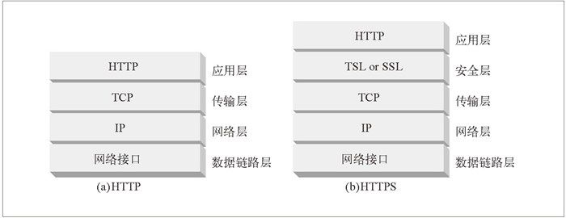
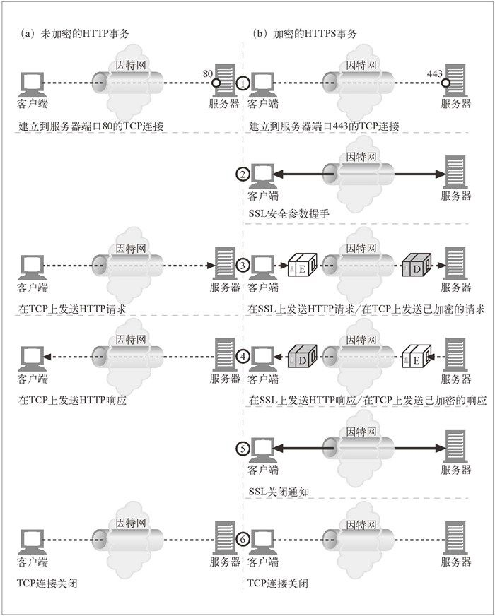
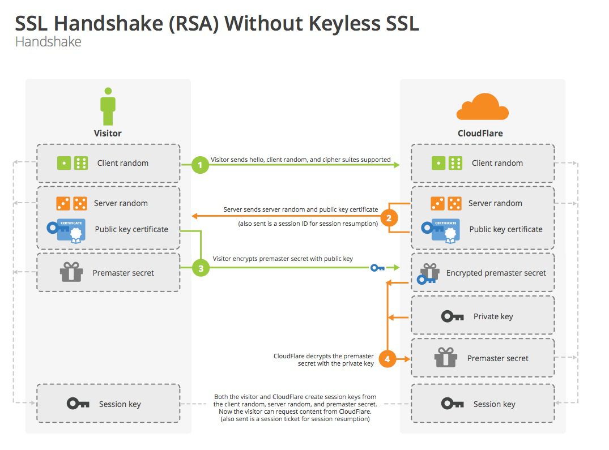
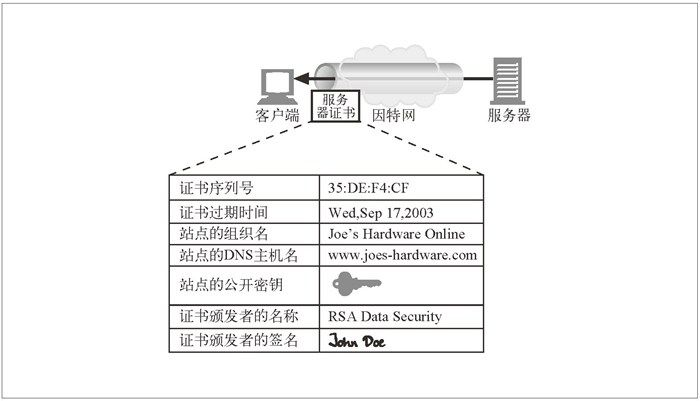
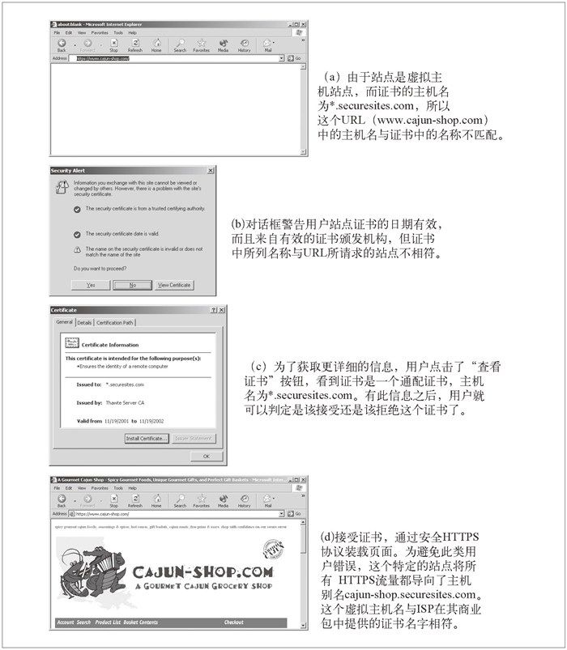

## HTTPS协议
HTTPS 是最流行的 HTTP 安全形式。由网景公司首创的，目前所有主流浏览器和服务器都支持此协议。HTTPS 方案的 URL 以 `https://`，而不是 `http://` 开头。
使用 HTTPS 时，所有的 HTTP 请求和响应数据在发送到网络之前，都要进行加密。HTTPS 在 HTTP 下面提供了一个传输级的密码安全层——可以使用 SSL或传输层安全（Transport Layer Security，TLS）。

在 HTTP 中，客户端会打开一条到 Web 服务器端口 80 的 TCP 连接，发送一条请求报文，接收一条响应报文，关闭连接。

在 HTTPS 中，客户端首先打开一条到 Web 服务器端口 443（安全 HTTP 的默认端口）的连接。

SSL/TLS协议的基本过程如下：

（1） 客户端向服务器端索要数字证书并验证公钥。

（2） 双方协商生成"对话密钥"。

（3） 双方采用"对话密钥"进行加密通信。

开始加密通信之前，客户端和服务器首先必须建立连接和交换参数，这个过程叫做握手（handshake），上面的第一步和第二步。

## SSL握手

第一步，客户端给出协议版本号、一个客户端生成的随机数（Client random），以及客户端支持的加密方法。

第二步，服务端确认双方使用的加密方法，并给出数字证书、以及一个服务器生成的随机数（Server random）。

第三步，客户端确认数字证书有效，然后生成一个新的随机数（Premaster secret），并使用数字证书中的公钥加密这个随机数然后发给服务端。

第四步，服务端使用自己的私钥，获取客户端发来的随机数（即Premaster secret）。

> 如果将加密算法改为[Diffie-Hellman算法](http://zh.wikipedia.org/wiki/迪菲－赫尔曼密钥交换)则可以Premaster secret不需要传递，可以通过双方交换各自的参数然后算出来。

第五步，客户端和服务端根据约定的加密方法，使用前面的三个随机数，生成"对话密钥"（session key），用来加密接下来的整个对话过程。

证书

证书的校验

- 日期检测：浏览器检查证书的起始日期和结束日期，以确保证书仍然有效。如果证书过期了，或者还未被激活，则证书有效性验证失败，浏览器显示一条错误信息。

- 签名颁发者可信度检测：每个证书都是由某些证书颁发机构（CA）签发的，它们负责为服务器担保。证书有不同的等级，每种证书都要求不同级别的背景验证。

  > 通常情况下浏览器会附带一个签名颁发机构的受信列表

- 签名检测：浏览器对签名使用签名颁发机构的公开密钥，并将其与校验码进行比较

- 站点身份检测：去验证证书中的域名与它们所对话的服务器的域名是否匹配。

证书名不匹配引发的证书错误对话框

