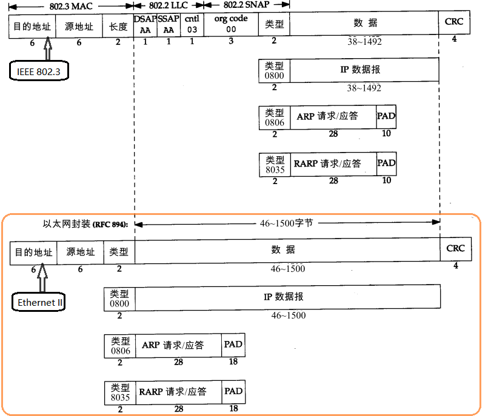

以太网：(Ethernet)，目前最广泛的局域网通信技术。运行速率有10Mbps,100Mbps,1Gbps,10Gbps。 传输的数据包称做以太帧，或者以太网数据帧

## 以太帧的工作机制

当以太网软件从网络层接收到数据报之后，需要完成如下操作：

1. 根据需要把网络层的数据分解为较小的块，以符合以太网帧数据段的要求。大部分的以太网帧的大小 64～1518 =（不包含前导码）。

2. 把数据块打包成帧。每一帧都包含数据及其他信息。

3. 把数据帧传递给对应于 OSI 模型物理层的底层组件，后者把帧转换为比特流，并且通过传输介质发送出去。

4. 以太网上的其他网络适配器接收到这个帧，检查帧头中的目的MAC地址。

   如果目的MAC地址不是本机MAC地址，也不是本机侦听的组播或广播MAC地址，则主机会丢弃收到的帧。
   如果目的MAC地址是本机MAC地址，则接收该帧，检查帧校验序列（FCS）字段，并与本机计算的值对比来确定帧在传输过程中是否保持了完整性。
   如果检查通过，就会剥离帧头和帧尾，然后根据帧头中的Type字段来决定把数据发送到哪个上层协议进行后续处理。

[[MTU]]

[[局域网]]

[[环回]]

[[以太网数据帧]]

[[MAC地址]]