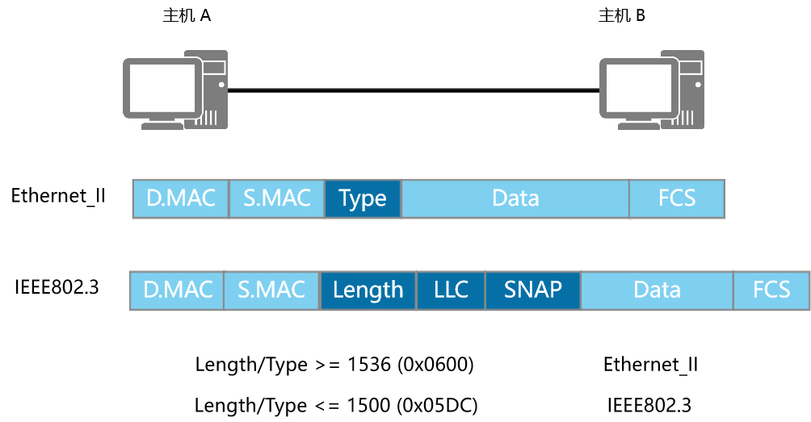
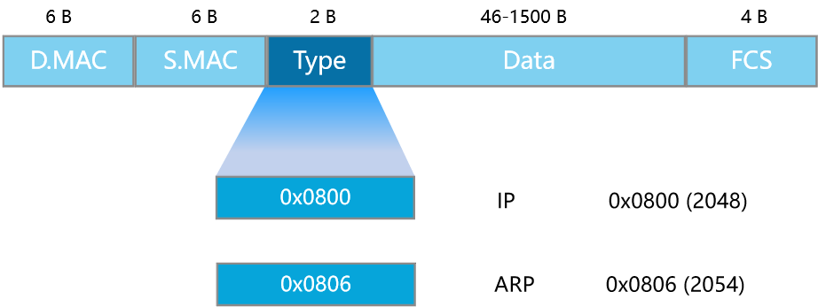
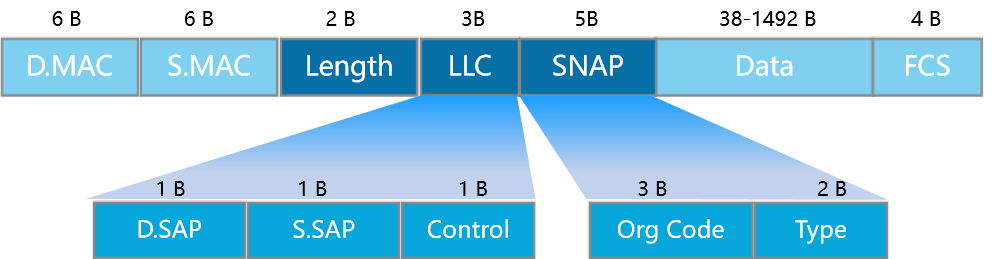

## 帧格式

数据包在以太网物理介质上传播之前必须封装头部和尾部信息，封装后的数据包称为数据帧，数据帧中封装的信息决定了数据如何传输。
以太网上传输的数据帧有两种格式，选择哪种格式由TCP/IP协议簇中的**网络层决定**。

以太网上使用两种标准帧格式。
第一种是上世纪80年代初提出的DIX v2格式，即Ethernet II帧格式。
第二种是1983年提出的IEEE 802.3格式。

**不同的Type字段值可以用来区别这两种帧的类型**

1. 当Type字段值小于等于1500（或者十六进制的0x05DC）时，帧使用的是IEEE 802.3格式。
2. 当Type字段值大于等于1536 （或者十六进制的0x0600）时，帧使用的是Ethernet II格式（普遍）。

### Ethernet_II帧格式

**Ethernet_II 帧类型值大于等于1536 (0x0600)，以太网数据帧的长度在64-1518字节之间。**

**Ethernet_II的帧中各字段说明如下：**

| 字段                    | 含义                                                         |
| :---------------------- | :----------------------------------------------------------- |
| DMAC（Destination MAC） | 目的MAC地址。                                                |
| SMAC（Source MAC）      | 源MAC地址。                                                  |
| 类型字段（Type）        | 用于标识数据字段中包含的高层协议。类型字段取值为0x0800的帧代表IP协议帧；类型字段取值为0x0806的帧代表ARP协议帧。 |
| 数据字段（Data）        | 网络层数据，最小长度必须为46字节以保证帧长至少为64字节，数据字段的最大长度为1500字节。 |
| 循环冗余校验字段（FCS） | 提供了一种错误检测机制。                                     |

### IEEE802.3帧格式

**IEEE802.3帧长度字段值小于等于1500 (0x05DC)**

IEEE802.3帧格式类似于Ethernet_II帧，只是Ethernet_II帧的Type域被802.3帧的Length域取代，并且占用了Data字段的8个字节作为LLC和SNAP字段。Length字段定义了Data字段包含的字节数。

**逻辑链路控制LLC（Logical Link Control**）由目的服务访问点DSAP（Destination Service Access Point）、源服务访问点SSAP（Source Service Access Point）和Control字段组成。

**SNAP（Sub-network Access Protocol**）由机构代码（Org Code）和类型（Type）字段组成。Org Code三个字节都为0。Type字段的含义与Ethernet_II帧中的Type字段相同。IEEE802.3帧根据DSAP和SSAP字段的取值又可分为以下几类：
1）当DSAP和SSAP都取特定值0xff时，802.3帧就变成了Netware-ETHERNET帧，用来承载NetWare类型的数据。
2）当DSAP和SSAP都取特定值0xaa时，802.3帧就变成了ETHERNET_SNAP帧。ETHERNET_SNAP帧可以用于传输多种协议。
3）DSAP和SSAP其他的取值均为纯IEEE802.3帧。