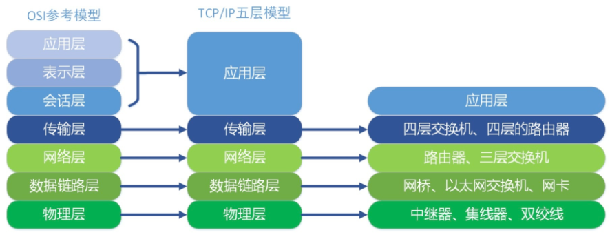
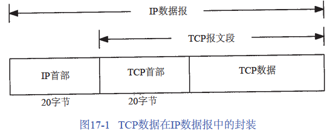
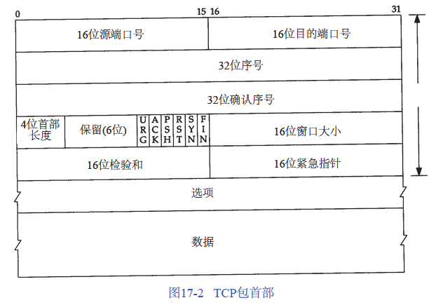
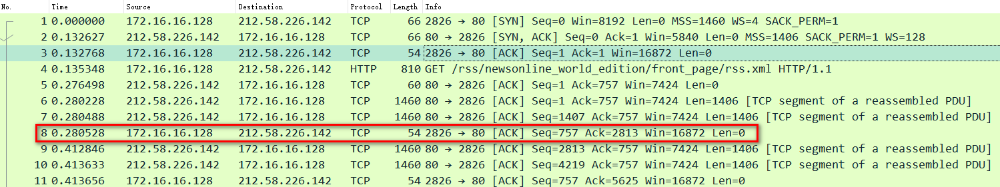
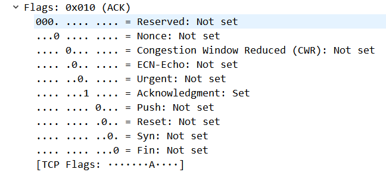

TCP（Transmission Control Protocol）提供一种面向连接的、可靠的字节流服务，即两个应用在使用 TCP交换数据之前必须先建立一个 TCP连接。

TCP/IP与OSI参考模型

> TCP/IP四层模型中将五层模型中的数据链路层以及物理层合并为链路层

## TCP首部

TCP数据被封装在IP数据报中。

TCP首部共20字节（不计算可选值）

**源端和目的端的端口号**：用于定位发端和收端应用进程，与IP首部中的源端IP地址和目的端IP地址确定唯一TCP连接。2^16 = 65536

**序号**：32 bit的无符号数，到达2^32 -1后又从0开始。
> Sequence Number (32 bits): 
> 在 SYN flag 置 1 时，此为当前连接的初始序列号（Initial Sequence Number, ISN），数据的第一个字节序号为此 ISN + 1
> 在 SYN flag 置 0 时，为当前连接报文段的累计数据包字节数。
> 
> Acknowledgment number (32 bits): 
> 32 位确认序号，ACK flag 置 1 时才有效，指接收方期待的下一个报文段的序列号。

**确认序号**：发送确认的一端（接收端）所期望收到的下一个序号。确认序号为接收到之前已成功收到数据字节序号加 1

**首部长度**：20字节的固定长度 + 可选项长度。4位，每位代表4个字节。即用4位表示16个字节

**标识位**：

| - | - |
|---|---|
| URG | 紧急指针（urgent pointer）,表示TCP包的紧急指针域有效 |
| ACK | 此标志表示应答域有效，TCP数据包中包含确认号;1表示应答域有效，0 表示无效; |
| PSH | 表示Push操作，即数据包到达接收端以后，立即传送给应用程序， 而不是在缓冲区中排队 |
| RST | 重建连接。用以指出连接被异常终止或拒绝连接的请求 |
| SYN | 同步序号，用来建立连接。 与ACK标志位搭配使用，当连接请求的时候，SYN=1， ACK=0;连接被响应的时候，SYN=1，ACK=1;|
| FIN | 发端完成发送任务。 |

> SYN 标志的数据包经常被用来进行端口扫描。扫描者发送一个只有SYN的数据包，如果对方主机响应了一个数据包回来 ，就表明这台主机存在这个端口;

**窗口大小**：表明接收端期望接收的字节，用于TCP流量控制，单位字节

**检验和**： 用于TCP首部和TCP数据校验

**紧急指针**：配合标识位中的URG标识。紧急指针（正的偏移量）+ 序号 = 紧急数据最后一个字节的序号。

选项：
MSS (Maximum Segment Size)：最长报文大小，表明本端所能接收的最大长度的报文段

> 报文段越大允许每个报文段传送的数据就越多

#red

[[TCP连接]]

[[可靠传输]]

超文本传输协议-HTTP