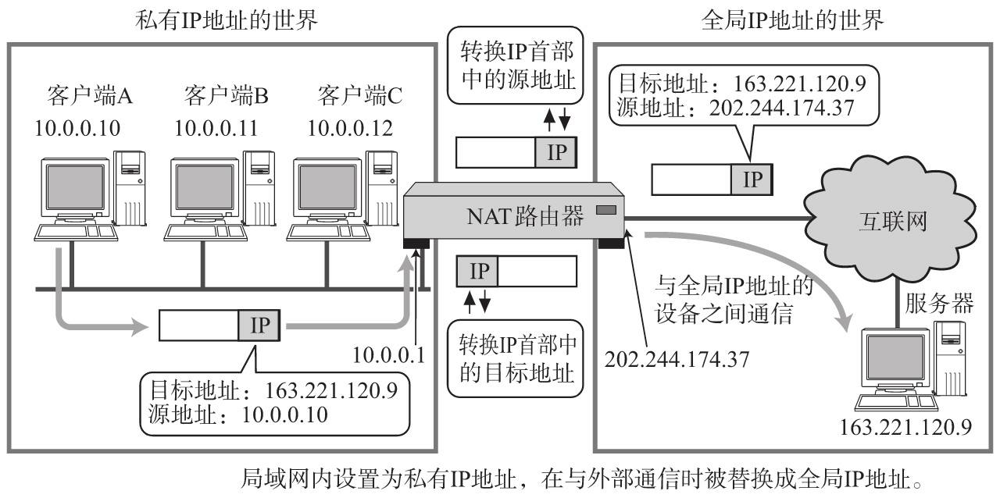
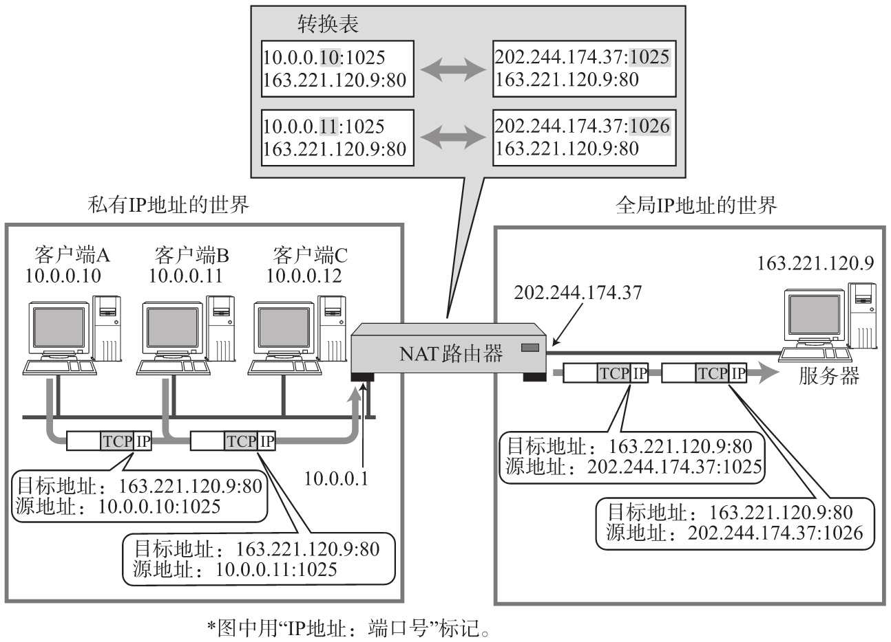
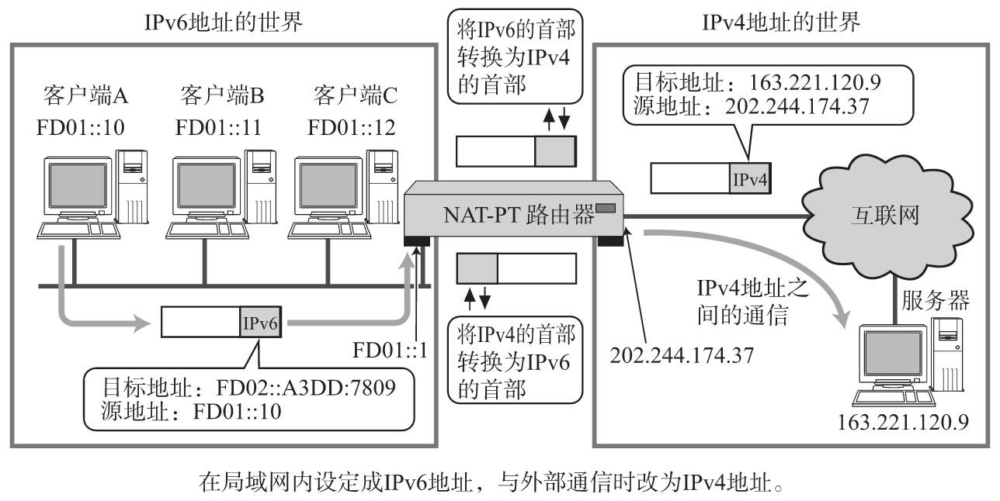

全局地址与私有地址-NAT

**NAT（Network Address Translator）** 用于在本地网络中使用私有地址，在连接互联网时转而使用全局IP地址的技术。
**NAPT（Network Address Ports Translator）** 支持转换TCP、UDP端口号。

假设主机10.0.0.10需要与主机163.221.120.9进行通信。利用本地网路中的NAT路由器将发送源地址从10.0.0.10转换为全局的IP地址（202.244.174.37）再发送数据。

如果包从地址163.221.120.9发过来时，目标地址（202.244.174.37）会先被本地网络中的NAT路由器转换成私有IP地址10.0.0.10以后再被转发。

NAT-PT：支持将IPv6的首部转换为IPv4的首部。从而实现IPv6地址的主机也就能够与IPv4地址的其他主机进行通信。

[[IP隧道]]