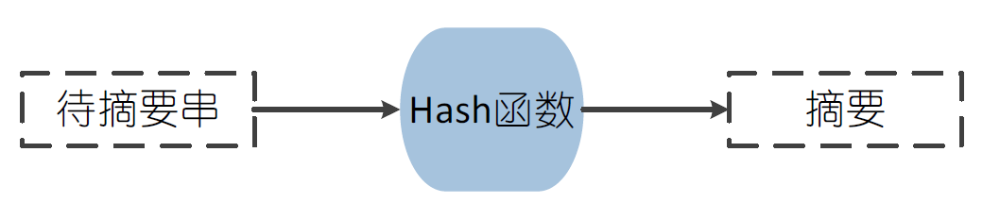
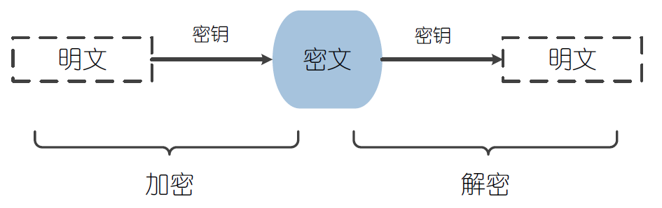
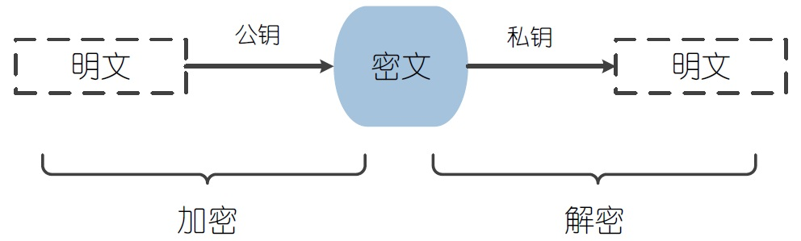
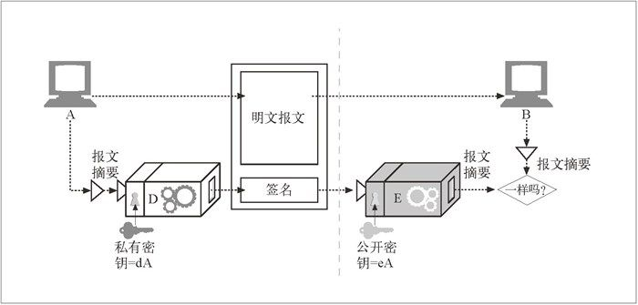
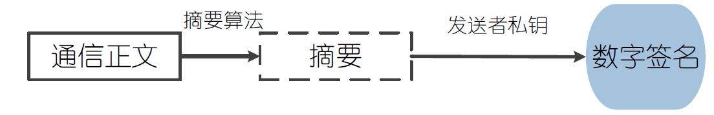
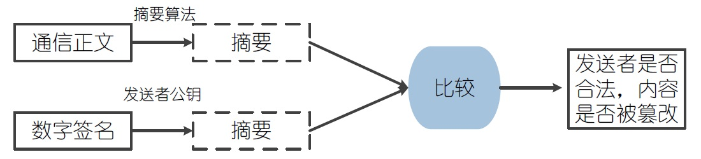
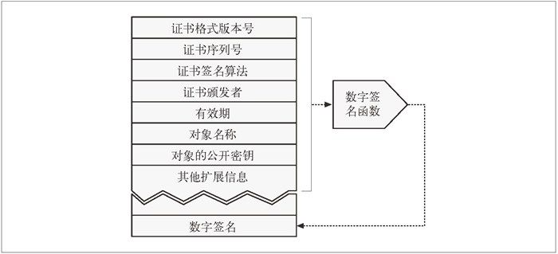
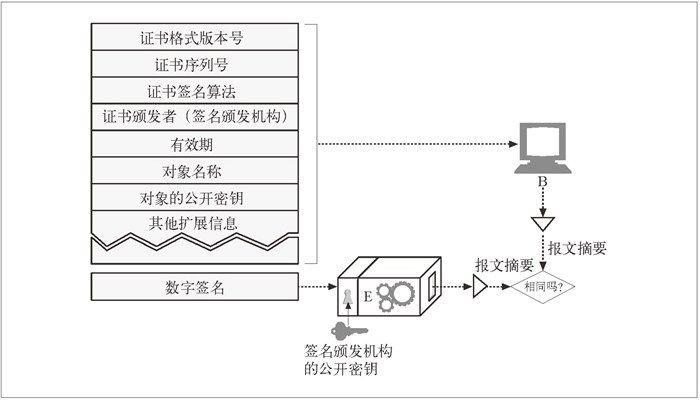

### 数字摘要

数字摘要也称为消息摘要，它是一个唯一对应一个消息或文本的固定长度的值，它由一个单向Hash函数对消息进行计算而产生。如果消息在传递的途中改变了，接收者通过对收到消息采用相同的Hash重新计算，新产生的摘要与原摘要进行比较，就可知道消息是否被篡改了，因此消息摘要能够验证消息的完整性。消息摘要采用单向Hash函数将需要计算的内容"摘要"成固定长度的串，这个串亦称为数字指纹。这个串有固定的长度，且不同的明文摘要成密文，其结果总是不同的(相对的)，而同样的明文其摘要必定一致。这样这串摘要便可成为验证明文是否是"真身"的"指纹"了。

#### MD5

MD5即Message Digest Algorithm 5(信息摘要算法5)，是数字摘要算法一种实现，用于确保信息传输完整性和一致性，摘要长度为128位。MD5由MD4、MD3、MD2改进而来，主要增强算法复杂度和不可逆性，该算法因其普遍、稳定、快速的特点，在产业界得到了极为广泛的使用，目前主流的编程语言普遍都已有MD5算法实现。

#### SHA

SHA的全称是Secure Hash Algorithm，即安全散列算法。1993年，安全散列算法(SHA)由美国国家标准和技术协会（NIST)提出，并作为联邦信息处理标准(FIPS PUB 180)公布，1995年又发布了一个修订版FIPS PUB 180-1，通常称之为SHA-1。SHA-1是基于MD4算法的，现在已成为公认的最安全的散列算法之一，并被广泛使用。SHA-1算法生成的摘要信息的长度为160位，由于生成的摘要信息更长，运算的过程更加复杂，在相同的硬件上，SHA-1的运行速度比MD5更慢，但是也更为安全。

### 对称加密

对称加密算法是应用较早的加密算法，技术成熟。在对称加密算法中，数据发送方将明文(原始数据)和加密密钥一起经过特殊加密算法处理后，生成复杂的加密密文进行发送，数据接收方收到密文后，若想读取原文，则需要使用加密使用的密钥及相同算法的逆算法对加密的密文进行解密，才能使其恢复成可读明文。在对称加密算法中，使用的密钥只有一个，发送和接收双方都使用这个密钥对数据进行加密和解密，这就要求加密和解密方事先都必须知道加密的密钥。

#### DES算法

1973 年，美国国家标准局(NBS)在认识到建立数据保护标准既明显又急迫的情况下，开始征集联邦数据加密标准的方案。1975 年3月17日，NBS公布了IBM公司提供的密码算法，以标准建议的形式在全国范围内征求意见。经过两年多的公开讨论之后，1977 年7月15日，NBS宣布接受这建议，作为联邦信息处理标准46 号数据加密标准(Data Encryptin Standard)，即DES正式颁布，供商业界和非国防性政府部门使用。

DES算法属于对称加密算法，明文按64位进行分组，密钥长64位，但事实上只有56位参与DES运算(第8、16、24、32、40、48、56、64位是校验位，使得每个密钥都有奇数个1),分组后的明文和56位的密钥按位替代或交换的方法形成密文。

由于计算机运算能力的增强，原版DES密码的密钥长度变得容易被暴力破解，因此演变出了3DES算法。3DES是DES向AES过渡的加密算法，它使用3条56位的密钥对数据进行三次加密，是DES的一个更安全的变形。

#### AES算法

AES的全称是Advanced Encryption Standard，即高级加密标准，该算法由比利时密码学家Joan Daemen和Vincent Rijmen所设计，结合两位作者的名字，又称Rijndael加密算法，是美国联邦政府采用的一种对称加密标准，这个标准用来替代原先的DES算法，已经广为全世界所使用，已然成为对称加密算法中最流行的算法之一。

AES算法作为新一代的数据加密标准汇聚了强安全性、高性能、高效率、易用和灵活等优点，设计有三个密钥长度:128,192,256位，比DES算法的加密强度更高，更为安全。

### 非对称加密

非对称加密算法又称为公开密钥加密算法，它需要两个密钥，一个称为公开密钥(public key)，即公钥，另一个称为私有密钥(private key)，即私钥。公钥与私钥需要配对使用，如果用公钥对数据进行加密，只有用对应的私钥才能进行解密，而如果使用私钥对数据进行加密，那么只有用对应的公钥才能进行解密。因为加密和解密使用的是两个不同的密钥，所以这种算法称为非对称加密算法。

非对称加密算法实现机密信息交换的基本过程是：甲方生成一对密钥并将其中的一把作为公钥向其它人公开，得到该公钥的乙方使用该密钥对机密信息进行加密后再发送给甲方，甲方再使用自己保存的另一把专用密钥，即私钥，对加密后的信息进行解密。

#### RSA算法

RSA非对称加密算法是1977年由Ron Rivest、Adi Shamirh和LenAdleman开发的，RSA取名来自开发他们三者的名字。RSA是目前最有影响力的非对称加密算法，它能够抵抗到目前为止已知的所有密码攻击**，已被ISO推荐为公钥数据加密标准**。RSA算法基于一个十分简单的数论事实：将两个大素数相乘十分容易，但反过来想要对其乘积进行因式分解却极其困难，因此可以将乘积公开作为加密密钥。

总结：既然是加密，那肯定是不希望别人知道我的消息，所以只有我才能解密，所以可得出公钥负责加密，私钥负责解密；同理，既然是签名，那肯定是不希望有人冒充我发消息，只有我才能发布这个签名，所以可得出私钥负责签名，公钥负责验证。服务端保存多份公钥，客户端保存自己的私钥。 基本流程如下：

1.  获取RSA私钥Base64编码版本（由服务端提供）
2.  将Base64编码版本的私钥转换成RSA私钥对象
3.  通过Base64解码私钥字符串获取到一个字节数组对象
4.  调用平台相关算法获取到RSA私钥对象
5.  创建RSA请求加密对象，指定签名算法为 SHA384withRSA
6.  将请求的参数排序并且通过MD5算法计算MD5值
7.  将计算出来的MD5值，与RSA私钥对象传递给平台签名服务，得到RSA签名字节数组
8.  使用Base64编码RSA签名字节数组，得到字符串版的RSA签名对象（注意：有的客户端有可能在Base64编码后会多出换行符，如android。对于存在换行符的要客户端处理Base64.NO_WRAP）
9.  使用URL编码（utf-8）字符串版的RSA签名对象（客户端框架有的已经封装，如android）
10.  将第7步的字符串通过参数sign传递给服务端

### 数字签名

签名：加密报文，以说明是谁编写的报文，同时证明报文未被篡改过。数字签名是附加在报文上的特殊加密校验码。

通信正文经过相应的摘要算法生成摘要后，使用消息发送者的私钥进行加密，生成数字签名。

### 数字证书

数字证书(Digital Certificate)：包含由某个受信任组织担保的用户或公司的相关信息。数字证书没有单一的全球标准，但大多数证书都以一种标准格式——X.509 v3，来存储它们的信息。

| 字　　段  |  描　　述|
|---|---|
| 版本  | 这个证书的 X.509 证书版本号。 |
| 序列号 | 证书颁发机构（CA）生成的唯一整数。CA 生成的每个证书都要有一个唯一的序列号 |
| 签名算法 ID | 签名所使用的加密算法。例如，“用 RSA 加密的 MD2 摘要” |
| 证书颁发者   | 发布并签署这个证书的组织名称，以 X.500 格式表示 |
| 有效期 | 此证书何时有效，由一个起始日期和一个结束日期来表示 |
| 对象名称    | 证书中描述的实体，比如一个人或一个组织 |
| 对象的公开密钥信息  |  证书对象的公开密钥，公开密钥使用的算法，以及所有附加参数 |
| 发布者唯一的ID（可选）| 可选的证书发布者唯一标识符，这样就可以重用相同的发布者名称 |
| 对象唯一的ID（可选） | 可选的证书对象唯一标识符，这样就可以重用相同的对象名称了 |
| 扩展  | 可选的扩展字段集（在版本 3 及更高的版本中使用）。每个扩展字段都被标识为关键或非关键的。关键扩展非常重要，证书使用者一定要能够理解。如果证书使用者无法识别出关键扩展字段，就必须拒绝这个证书。 目前在使用的常用扩展字段包括： 基本约束 对象与证书颁发机构的关系 证书策略 授予证书的策略 密钥的使用  对公开密钥使用的限制|
|证书的颁发机构签名   | 证书颁发机构用指定的签名算法对上述所有字段进行的数字签名|

用证书对服务器进行认证：通过 HTTPS 建立了一个安全 Web 事务之后，现代的浏览器都会自动获取所连接服务器的数字证书。如果服务器没有证书，安全连接就会失败。

校验证书

浏览器收到证书时会对签名颁发机构进行检查。如果这个机构是个很有权威的公共签名机构（浏览器会预先安装很多签名颁发机构的证书）就可以进行签名验证。如果对签名颁发机构一无所知，则浏览器通常会向用户显示一个对话框，由用户选择是否信任此签名发布者。

证书管理

任何机构或者个人都可以申请数字证书，并使用数字证书对网络通信保驾护航，要获得数字证书，首先需要使用数字证书管理工具，如KeyTool、OpenSSL等等，构建CSR(Certificate Signing Request，数字证书签发申请)，提交给数字证书认证机构进行签名，最终形成数字证书。

keytool

KeyTool是java的数字证书管理工具，用于数字证书的生成、导入、导出以及撤销等操作。它与本地密钥库关联，并可以对本地密钥库进行管理，可以将私钥存放于密钥库，而公钥则使用数字证书进行输出。

OpenSSL

OpenSSL包含一个开源的SSL协议的实现，虽然OpenSSL使用SSL作为其名字的重要组成部分，但其实现的功能却远远超出了SSL协议本身。OpenSSL事实上包括了三个组成部分：SSL协议库、密码算法库以及各种与之相关的应用程序。同时作为一个基于密码学的安全开发包，OpenSSL提供的功能相当强大和全面，囊括了主要的密码算法、常用的密钥和证书封装管理功能以及SSL协议，并提供了丰富的应用程序供测试或其它目的使用。
