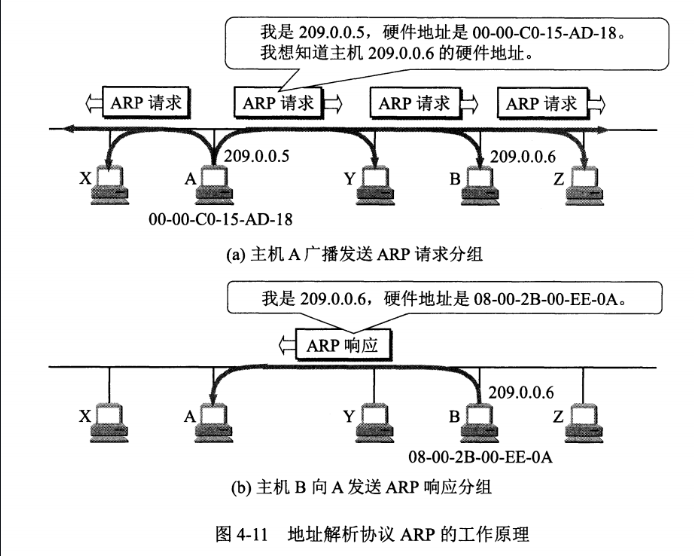
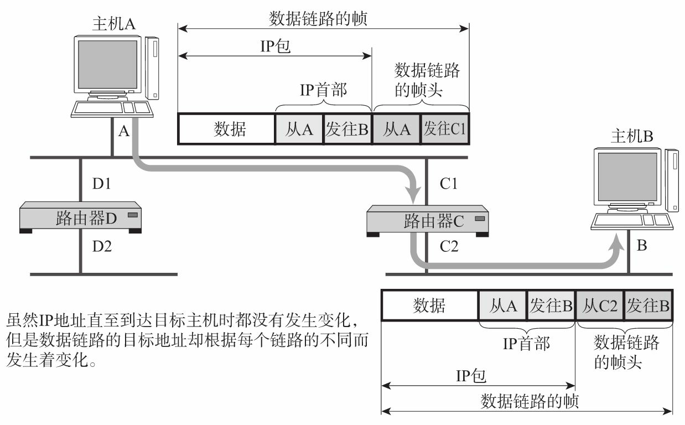

ARP（Address Resolution Protocol）：提供从网络层到硬件地址的动态映射。

> 通过广播的方式定位下一个应该接收数据分包的网络设备对应的MAC地址。
> 每个主机都有一个 ARP 高速缓存，里面有本局域网上的各主机和路由器的 IP 地址到 MAC 地址的映射表。

### 目标主机与本地主机在同一个IP子网
假设主机 A 期望知道主机 B 的 IP 地址，但是 ARP 高速缓存中没有该 IP 地址到 MAC 地址的映射，
此时主机 A 通过广播的方式发送 ARP 请求分组，主机 B 收到该请求后会发送 ARP 响应分组给主机 A 告知其 MAC 地址，
随后主机 A 向其高速缓存中写入主机 B 的 IP 地址到 MAC 地址的映射。

### 目标主机与本地主机不在同一个IP子网
假设主机A想要发送IP数据报给主机B时必须得经过路由器C。由于路由器C会隔断两个网络，因此主机A必须得先将数据报发送到路由器C。

RARP（Reverse Address Resolution Protocol）是将ARP反过来，从MAC地址定位IP地址的一种协议。常用于小型嵌入式设备接入到网络，比如打印机。

[[ARP报文格式]]

[[广播与多播]]
