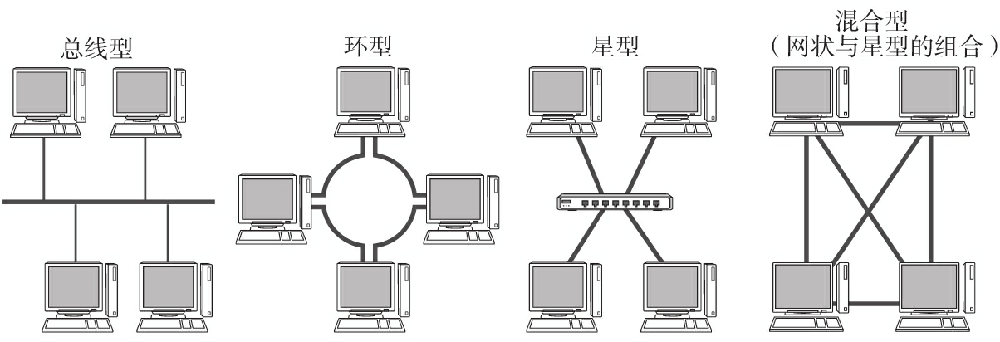
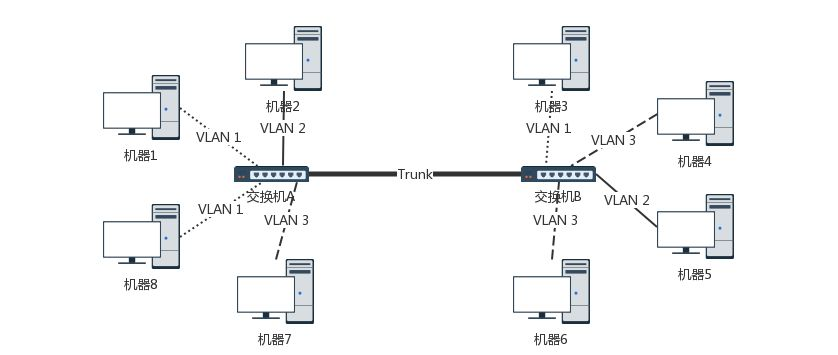

## 局域网

局域网：（Local Area Network，LAN）， 局域网是一个局部范围的计算计组，比如家庭网络就是一个小型的局域网，里面包含电脑、手机和平板等，他们共同连接到你家的路由器上。主要有以太网、令牌环网、FDDI 和 ATM 等局域网技术，目前以太网占领着有线局域网市场。

广域网：（WAN，Wide Area Network），广域网的范围就比较大了，可以把你家和别人家、各个省、各个国家连接起来相互通信。广域网和局域网都是从范围的角度来划分的，广域网也可以看成是很多个局域网通过路由器等相互连接起来。

## 虚拟局域网

虚拟局域网可以建立与物理位置无关的逻辑组，在同一个虚拟局域网中的成员才会收到链路层广播信息（需要交换机支持）。

在原有的以太网帧格式上新增tag，里面包含一个12bit的VLAN ID，如果交换机是支持 VLAN，则会把二层的头取下来识别VLAN ID。只有相同 VLAN 的包，才会互相转发。
此时对于交换机而言，每个 VLAN 的口都是可以重新设置。对于支持 VLAN 的交换机，交换机之间可以通过Trunk口相互连接。

> Trunk 口可以转发属于任何 VLAN 的口

