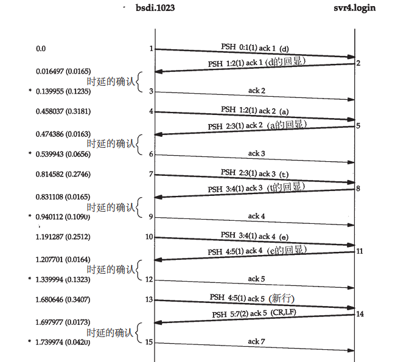
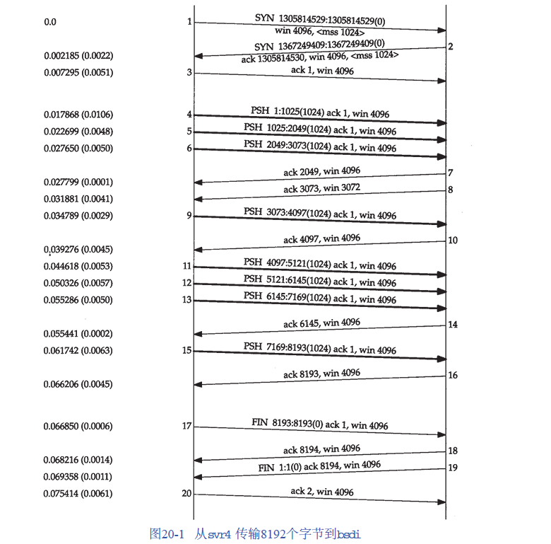

经受时延的确认：TCP在接收到数据时并不立即发送ACK；相反，它推迟发送，以便将ACK与需要沿该方向发送的数据一起发送（有时称这种现象为数据捎带ACK）。绝大多数实现采用的时延为200ms，也就是说，TCP将以最大200ms的时延等待是否有数据一起发送。

Nagle算法：要求一个TCP连接上最多只能有一个未被确认的未完成的小分组，在该分组的确认到达之前不能发送其他的小分组。TCP收集这些少量的分组，并在确认到来时以一个分组的方式发出去。

客户端向网络发送8个1024字节的数据`svr4 % sock -i -n8 bsdi 7777`

报文1-3，建立TCP连接，包含了连接双方的MSS的值

报文4-6：发送方首先传送3个数据报文段

报文7：确认了前两个数据报文段，通过其确认序号为2048可以判断

>报文段7的ACK的序号之所以是2048而不是3073是由以下原因造成的：
>
>当一个分组到达时，它首先被设备中断例程进行处理，然后放置到IP的输入队列中。三个报文段4、5和6依次到达并按接收顺序放到IP的输入队列。IP将按同样顺序将它们交给TCP。
>
>当TCP处理报文段4时，该连接被标记为产生一个经受时延的确认。TCP处理下一报文段（5），由于TCP现在有两个未完成的报文段需要确认，因此产生一个序号为2048的ACK（报文段7），并清除该连接产生经受时延的确认标志。
>
>TCP处理下一个报文段（6），而连接又被标志为产生一个经受时延的确认。在报文段9到来之前，由于时延定时器溢出，因此产生一个序号为3073的ACK（报文段8）。
>
>报文段8中的窗口大小为3072，表明在TCP的接收缓存中还有1024个字节的数据等待被应用程序读取。

报文11-16：说明了通常使用的“隔一个报文段确认”的策略。报文段11、12和13到达并被放入IP的接收队列。当报文段11被处理时，连接被标记为产生一个经受时延的确认。当报文段12被处理时，它们的ACK（报文段14）被产生且连接的经受时延的确认标志被清除。报文段13使得连接再次被标记为产生经受时延。但在时延定时器溢出之前，报文段15处理完毕，因此该确认立刻被发送。

>ACK：表示接收方已经正确收到了从0到确认序号减1的所有字节。通常只有一个IP首部和一个TCP首部。

