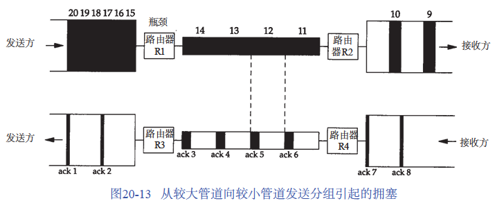
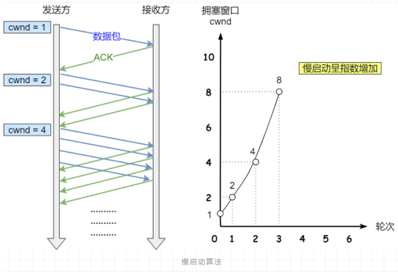
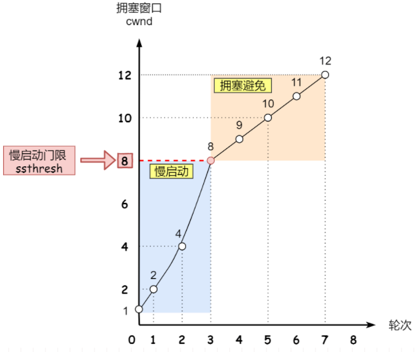
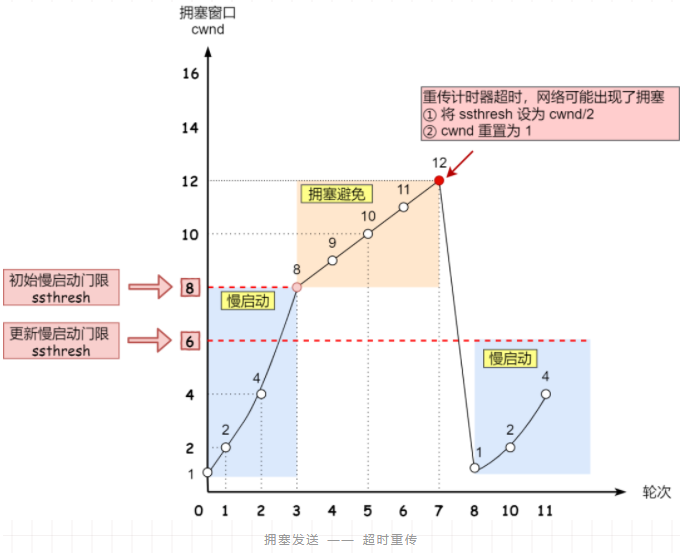
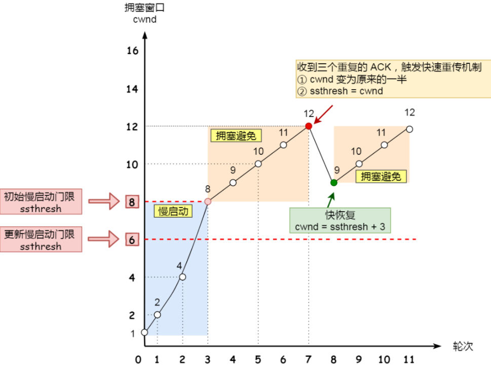
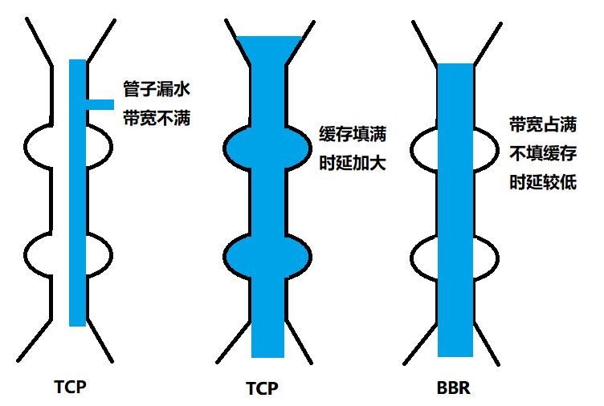

## 拥塞控制

流量控制是避免「发送方」的数据填满「接收方」的缓存，而拥塞控制主要是**避免「发送方」的数据填满整个网络**。

> 在网络出现拥堵时，如果继续发送大量数据包会导致数据包时延、丢失等。当发生数据包丢失或传递超时时 TCP 就会重传数据最后将加重网络的负担。
> 比如：当多个输入流到达一个路由器，而路由器的输出流小于这些输入流的总和时也会发生拥塞，如果瓶颈路由器由没有足够的缓存可以容纳这些分组则会发生路由器丢包行为

假设路由器 R1为“瓶颈”（发生拥塞）。从左侧速率较高的局域网接收数据并向右侧速率较低的广域网发送。
当路由器R2将所接收到的分组发送到右侧的局域网时，这些分组之间的间隔与在最慢链路上的一致，尽管局域网具有更高的带宽。

流量控制中发送窗口 `swnd` 和接收窗口 `rwnd` 是约等于的关系，在加入了拥塞窗口后，此时发送窗口为`swnd = min(cwnd, rwnd)`。
> 拥塞窗口 `cwnd` 变化的规则：只要网络中没有出现拥塞，`cwnd` 就会增大；但网络中出现了拥塞，`cwnd` 就减少；

拥塞窗口 `cwnd`，主要用于依据网络的拥塞程度动态调节所要发送数据的量。拥塞控制主要是四个算法：慢启动、拥塞避免、拥塞发生、快速恢复

拥塞：当「发送方」没有在规定时间内接收到 ACK 应答报文，就会发生超时重传，也可以说出现网络拥塞

### 慢启动

TCP 在刚建立连接完成后，
首先进入慢启动的过程，一点一点的提高发送数据包的数量，**当发送方每收到一个 ACK，就拥塞窗口 cwnd 的大小就会加 1**。发包的个数以**指数性的增长**。

假定拥塞窗口 (congestion window) `cwnd` 和发送窗口 `swnd` 相等：

- 连接建立完成时 `cwnd = 1`。表示可以发送一个 `MSS` 大小的数据

- 当收到一个 ACK 确认应答后，`cwnd` 增加 1，表示可以发送两个 `MSS` 大小的数据

- 如此递增下去直到慢启动门限  `ssthresh` （slow start threshold，默认65535字节），则进入拥塞避免阶段

> 当 `cwnd < ssthresh` 时，使用慢启动算法，当 `cwnd >= ssthresh` 时，就会使用「拥塞避免」。

### 拥塞避免算法

当拥塞窗口 `cwnd` 「超过」慢启动门限 `ssthresh` 时，就会使用拥塞避免算法：**每当收到一个 ACK 时，cwnd 增加 1/cwnd。**

假定 `ssthresh` 为 `8`，因此在拥塞避免阶段，每个`ACK`增加 1/8，当8 个 ACK 确认时`cwnd = cwnd +1`，此时发送 9 个 `MSS` 大小的数据。发包的个数从指数**增长转到线性增长。**

直到网络进入了拥塞的状况而出现丢包现象，此时将触发重传机制，也就进入了「拥塞发生」阶段。

### 拥塞发生

拥塞发生时重传机制主要有两种：超时重传、快速重传

超时重传

此时`ssthresh` 设为 `cwnd/2`，`cwnd` 重置为 `1`。然后重新开始慢启动，最终将导致数据流的突然减少。

快速重传

当==接收方==发现丢了一个中间包的时候，发送三次前一个包的 ACK，于是==发送方==就会快速地重传，而不必等待超时再重传。

### 快速恢复

快速恢复的思想是“数据包守恒”原则，即同一个时刻在网络中的数据包数量是恒定的，只有当“老”数据包离开了网络后，才能向网络中发送一个“新”的数据包。
如果发送方收到一个重复的ACK就表明有一个数据包离开了网络，于是`cwnd = cwnd + 1`。

1. 当收到3个重复ACK时，设置`ssthresh = cwnd / 2, cwnd = ssthresh + 3`（收到3个重复的ACK），然后重传丢失的报文段。

2. 再收到重复的ACK时，拥塞窗口增加1。

3. 当收到新的数据包的ACK时，设置cwnd为ssthresh（在第1步中设置的值）。进入了拥塞避免算法

> 因为该ACK确认了新的数据，说明从重复ACK时的数据都已收到，该恢复过程已经结束，可以回到恢复之前的状态了，也即再次进入拥塞避免状态

TCP BBR 拥塞算法：通过不断的加快发送速度，将管道填满，但是不要填满中间设备的缓存（避免增加时延），在这个平衡点可以很好的达到高带宽和低时延的平衡。

https://blog.csdn.net/yangbodong22011/article/details/48500791?utm_medium=distribute.pc_relevant.none-task-blog-BlogCommendFromMachineLearnPai2-5.control&dist_request_id=1328679.21074.16161996359538973&depth_1-utm_source=distribute.pc_relevant.none-task-blog-BlogCommendFromMachineLearnPai2-5.control

