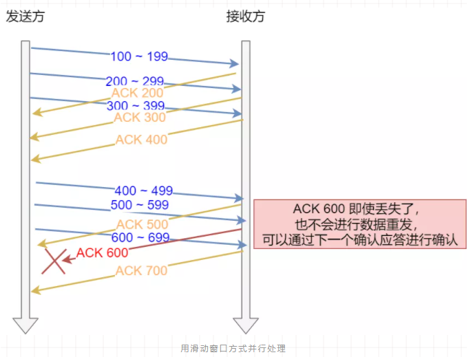
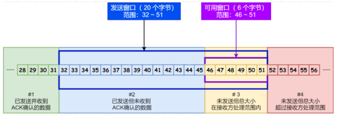
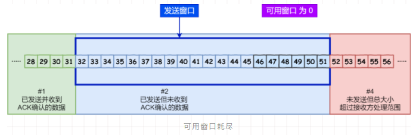
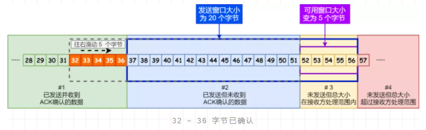
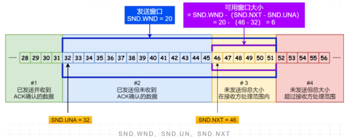
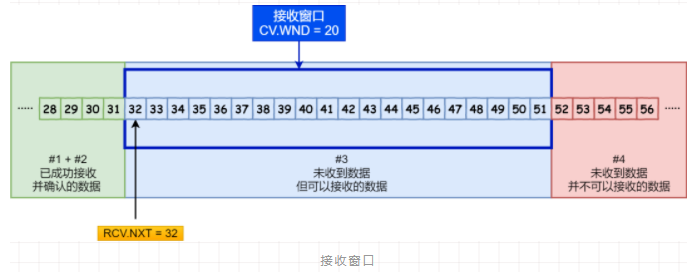

## 滑动窗口

 TCP 是每发送一个数据，都要进行一次确认应答。当上一个数据包收到了应答了， 再发送下一个。这样的传输方式有一个缺点：数据包的**往返时间越长，通信的效率就越低**。窗口大小是指**无需等待确认应答，而可以继续发送数据的最大值**。发送方主机在等到确认应答返回之前，必须在缓冲区中保留已发送的数据。如果按期收到确认应答，此时数据就可以从缓存区清除。

> 窗口的实现实际上是操作系统开辟的一个缓存空间

假设窗口大小为 `3` 个 TCP 段，那么发送方就可以「连续发送」 `3` 个 TCP 段，并且中途若有 ACK 丢失，可以通过「下一个确认应答进行确认」。

比如ACK 600 确认应答报文丢失可以通过发送方收到的 ACK 700进行 确认应答。

TCP 首部包含字段 `Window`，用于接收端告诉发送端自己还有多少缓冲区可以接收数据。于是发送端就可以根据这个接收端的处理能力来发送数据，而不会导致接收端处理不过来。

### 发送方的滑动窗口

根据处理的情况分成四个部分，深蓝色方框是发送窗口，紫色方框是可用窗口：

- \#1 已发送并收到 ACK确认的数据：1~31 字节
- \#2 已发送但未收到 ACK确认的数据：32~45 字节
- \#3 未发送但总大小在接收方处理范围内（接收方还有空间）：46~51字节
- \#4 未发送但总大小超过接收方处理范围（接收方没有空间）：52字节以后

当发送方把数据「全部」都一下发送出去后，可用窗口的大小就为 0 了，表明可用窗口耗尽在没收到 ACK 确认之前是无法继续发送数据了。

当收到之前发送的数据 `32~36` 字节的 ACK 确认应答后，如果发送窗口的大小没有变化，则**滑动窗口往右边移动 5 个字节，因为有 5 个字节的数据被应答确认**，接下来 `52~56` 字节又变成了可用窗口，那么后续也就可以发送 `52~56` 这 5 个字节的数据了。

TCP 滑动窗口方案使用三个指针来跟踪在四个传输类别中的每一个类别中的字节。

- `SND.WND`：表示发送窗口的大小（大小是由接收方指定的）；
- `SND.UNA`：是一个绝对指针，它指向的是已发送但未收到确认的第一个字节的序列号，也就是 #2 的第一个字节。
- `SND.NXT`：也是一个绝对指针，它指向未发送但可发送范围的第一个字节的序列号，也就是 #3 的第一个字节。
- 指向 #4 的第一个字节是个相对指针，它需要 `SND.UNA` 指针加上 `SND.WND` 大小的偏移量，就可以指向 #4 的第一个字节了。

那么可用窗口大小的计算就可以是：可用窗口大 = SND.WND -（SND.NXT - SND.UNA）

### 接收方的滑动窗口

根据处理的情况划分成三个部分：

- \#1 + #2 是已成功接收并确认的数据（等待应用进程读取）；
- \#3 是未收到数据但可以接收的数据；
- \#4 未收到数据并不可以接收的数据；

- `RCV.WND`：表示接收窗口的大小，它会通告给发送方。
- `RCV.NXT`：是一个指针，它指向期望从发送方发送来的下一个数据字节的序列号，也就是 #3 的第一个字节。
- 指向 #4 的第一个字节是个相对指针，它需要 `RCV.NXT` 指针加上 `RCV.WND` 大小的偏移量，就可以指向 #4 的第一个字节了。

[[糊涂窗口综合症]]

[[缓冲区与滑动窗口]]