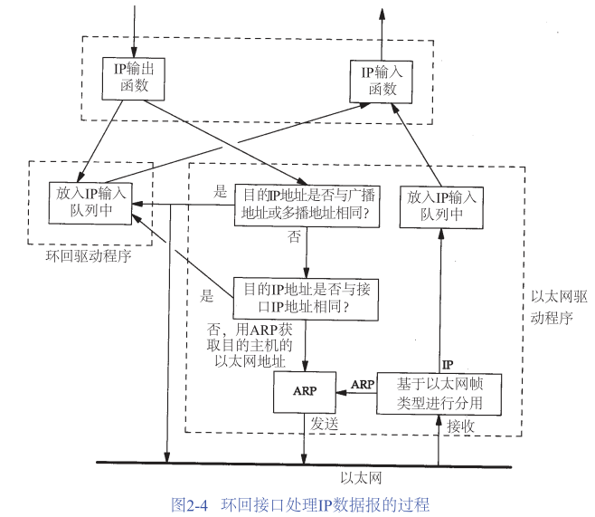

## 环回接口

环回接口：允许运行在同一台主机上的客户程序和服务器程序通过TCP/IP进行通信，IP地址通常为127.0.0.1并命名为localhost。

环回接口处理IP数据报的过程如下：

>注意：
>1)传给环回地址（一般是127.0.0.1）的任何数据均作为IP输入。

>2)传给广播地址或多播地址的数据报会复制一份传给环回接口，然后送到以太网上。

>3)任何传给该主机IP地址的数据均送到环回接口，即不会出现在网路上。

