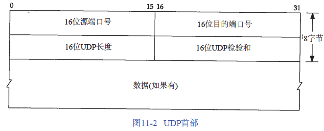
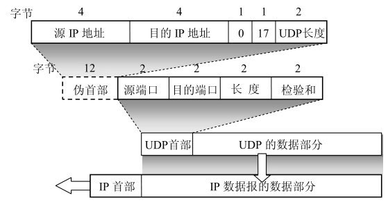
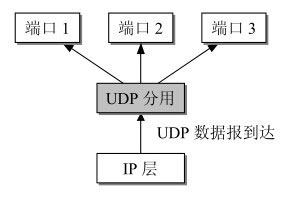
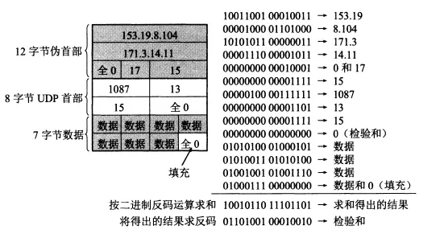

UDP（User Datagram Protocol）用户数据报协议，位于OSI参考模型中的传输层协议，是一种无连接的传输层协议，提供面向事务的简单不可靠信息传送服务。 UDP只在IP的数据报服务之上增加了复用和分用的功能以及差错检测的功能，

## UDP首部

源端口号与目的端口号：用于识别发送进程和接收进程。TCP和UDP的端口号可以重复。

> 当运输层从IP层收到UDP数据报时，就是根据首部中的目的端口，把UDP数据报通过相应的端口，上交最后的终点--应用程序。
>
> 
>
> 如果接收方UDP发现收到的报文中的目的端口号不正确，就会丢弃改报文，并由网际控制协议ICMP发送“端口不可达”差错报文给发送方。

UDP长度： UDP首部 + UDP数据的字节长度

UDP检验和：覆盖UDP首部 + UDP数据

> UDP和TCP的校验和都覆盖到了他们的首部和数据，而IP首部的校验和只覆盖了IP首部。

## UDP 校验和计算

计算校验和时，需要在UDP之前增加12个字节的伪首部。不在网络中传输，只是用在计算检验和。流程如下：

1. 将首部的校验和字段填充为0（零）
2. 把伪首部和用户数据报UDP看出16位的字符串连接起来
3. 如果数据部分不是偶数字节，则填充一个全零字节（该字节不发送到网络层）
4. 按二进制16位字求和然后再取反
5. 然后将和写入校验和字段，就可以发送到网络层了。

