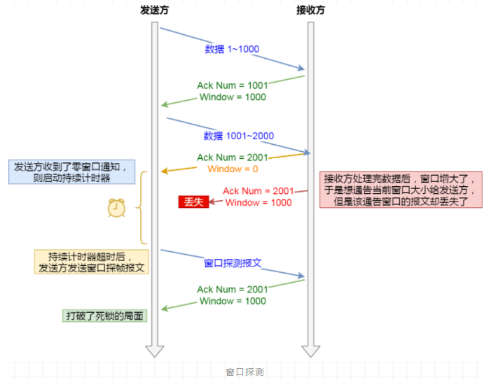

窗口关闭

TCP 通过让接收方指明希望从发送方接收的数据大小（窗口大小）来进行流量控制。**如果窗口大小为 0 时，就会阻止发送方给接收方传递数据，直到窗口变为非 0 为止，这就是窗口关闭。**

接收方向发送方通告窗口大小时，是通过 `ACK` 报文来通告的。当发生窗口关闭时，接收方处理完数据后，会向发送方通告一个窗口非 0 的 ACK 报文。

但如果这个通告窗口的 ACK 报文在网络中丢失了，导致发送方一直等待接收方的非 0 窗口通知，接收方也一直等待发送方的数据，如不不采取措施，这种相互等待的过程。因此TCP 为每个连接设有一个持续定时器，**只要 TCP 连接一方收到对方的零窗口通知，就启动持续计时器。**如果持续计时器超时，就会发送**窗口探测 ( Window probe ) 报文**，而对方在确认这个探测报文时，给出自己现在的接收窗口大小。

- 如果接收窗口仍然为 0，那么收到这个报文的一方就会重新启动持续计时器；

- 如果接收窗口不是 0，那么死锁的局面就可以被打破了。
