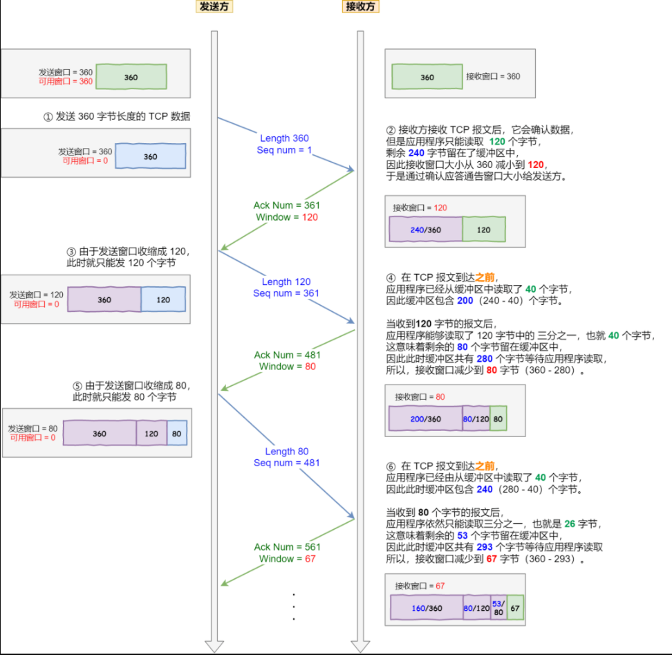

## 糊涂窗口综合症

如果接收方太忙了，来不及取走接收窗口里的数据，那么就会导致发送方的发送窗口越来越小。最后，**如果接收方腾出几个字节并告诉发送方现在有几个字节的窗口，而发送方会义无反顾地发送这几个字节，这就是糊涂窗口综合症**。

假设接收方的窗口大小是 360 字节，但接收方由于某些原因陷入困境，假设接收方的应用层读取的能力如下：

- 接收方每接收 3 个字节，应用程序就只能从缓冲区中读取 1 个字节的数据；
- 在下一个发送方的 TCP 段到达之前，应用程序还从缓冲区中读取了 40 个额外的字节；



接收方通常的策略如下:

当「窗口大小」小于 min( MSS，缓存空间/2 ) 时，就会向发送方通告窗口为 `0`，也就阻止了发送方再发数据过来。等到接收方处理了一些数据后，窗口大小 >= MSS，或者接收方缓存空间有一半可以使用，就可以把窗口打开让发送方发送数据过来。


发送方通常的策略:

使用 Nagle 算法，该算法的思路是延时处理，它满足以下两个条件中的一条才可以发送数据，默认打开：

- 数据大小 >= `MSS`
- 收到之前发送数据的 `ack` 回包

关闭方法：在Socket 设置 `TCP_NODELAY` 选项，比如需要小数据包交互的场景

```c
setsockopt(sock_fd, IPPROTO_TCP, TCP_NODELAY, (char *)&value, sizeof(int));
```

> Nagle 算法：主要是避免发送小的数据包，要求**TCP连接上最多只能有一个未被确认的小分组，在该分组的确认到达之前不能发送其他的小分组**。


[[延迟确认VSNagle算法]]