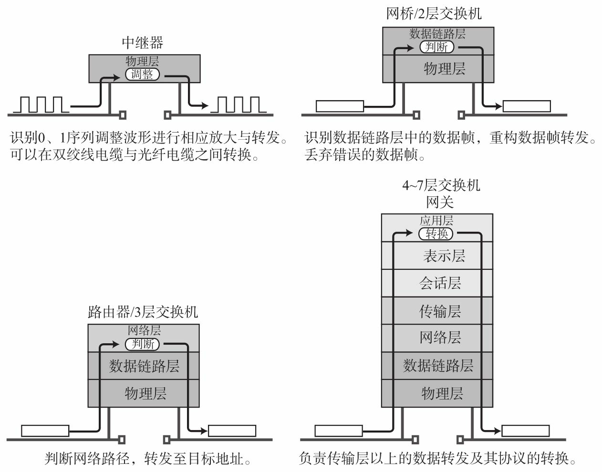

计算机之间通过电缆（双绞线电缆、光纤电缆、同轴电缆、串行电缆等）相互连接，而电缆依据具体的数据链路进行选择。

**网络接口卡**：集成了连接局域网功能的设备。也称为网络适配器、网卡、LAN卡

**中继器（Repeater）**: OSI模型中物理层面上延长网络的设备，将电缆传过来的电信号或光信号经波形==调整和放大==后传给其他电缆

**网桥**：工作在数据链路层，在不同或相同类型的LAN之间存储并依据MAC转发数据帧，

**路由器**（Router），用于在网络层面上连接两个网络、并对分组报文进行转发的设备。

> 网桥是根据物理地址（MAC地址）进行处理，而路由器则是根据IP地址进行处理的。

**4-7层交换机**：负责处理OSI模型中从传输层至应用层的数据。比如负载均衡、带宽控制、广域网加速器、特殊应用访问加速、防火墙

**调制解调器**（MODEM），将电话线传输的模拟信号与PC之间传输的数字信号互相转换

**交换机** 网桥和集线器的智能版

