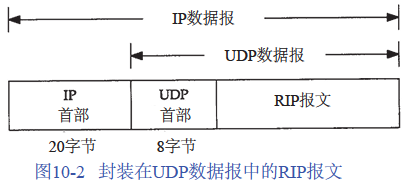
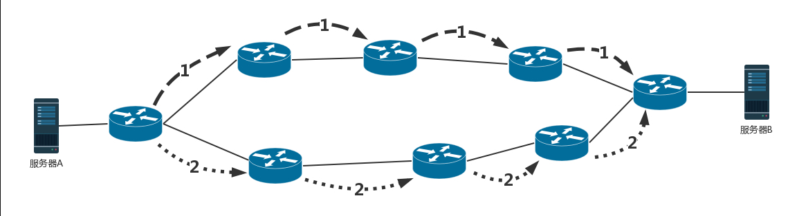
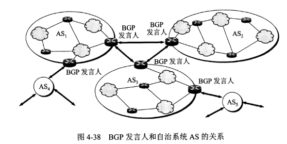

# 路由选择协议

Internet是以一组自治系统 (AS，Autonomous System)的方式组织的，每个自治系统通常由单个实体管理。通常将一个公司、大学校园、国家等定义为一个自治系统。每个自治系统可以选择该自治系统中各个路由器之间的选路协议。这种协议称之为内部网关协议IGP（Interior Gateway Protocol）或域内选路协议（intradomain routing protocol）。

最常用的IGP是选路信息协议 RIP。一种新的IGP是开放最短路径优先 OSPF（Open Shortest Path First）协议。它意在取代RIP。外部网关协议EGP（Exterier Gateway Protocol）或域内选路协议的分隔选路协议用于不同自治系统之间的路由器。

可以把路由选择协议划分为两大类：

- 自治系统内部的路由选择：RIP 和 OSPF
- 自治系统间的路由选择：BGP

## 内部网关协议 RIP

RIP 是一种基于距离向量的路由选择协议。距离是指跳数，直接相连的路由器跳数为 1。跳数最多为 15，超过 15 表示不可达。RIP 按固定的时间间隔仅和相邻路由器交换自己的路由表，经过若干次交换之后，所有路由器最终会知道到达本自治系统中任何一个网络的最短距离和下一跳路由器地址。

RIP报文包含中在UDP数据报中

距离向量算法：

- 每个路由器都保存一个路由表，表中每行包含两部分信息，一个是要到目标路由器，另一个是到目标路由器的距离。
- 每个路由器都知道自己和邻居之间的距离，每过几秒，每个路由器都将自己所知的到达所有的路由器的距离告知邻居，每个路由器也能从邻居那里得到相似的信息。
- 每个路由器根据新收集的信息，计算和其他路由器的距离，比如自己的一个邻居距离目标路由器的距离是 M，而自己距离邻居是 x，则自己距离目标路由器是 x+M。
- 若 3 分钟还没有收到相邻路由器的更新路由表，则把该相邻路由器标为不可达，即把距离置为 16。

RIP 协议实现简单，开销小。但是 RIP 能使用的最大距离为 15，限制了网络的规模。并且当网络出现故障时，要经过比较长的时间才能将此消息传送到所有路由器。

优点：RIP 协议实现简单，开销小。

缺点：

当网络出现故障时，要经过比较长的时间才能将此消息传送到所有路由器。比如路由器发生故障，此时是无法将消息通知给其他路由器的。

每次发送消息时需要发送整个路由表，容易造成网络浪费，因此适用于小于15跳的小型网络。

## 内部网关协议 OSPF

OSPF（Open Shortest Path First，开放式最短路径优先）一个基于链路状态路由协议。由于主要用于数据中心内部的路由决策，因而称为内部网关协议（Interior Gateway Protocol，简称IGP）。使用了 Dijkstra 提出的最短路径算法 SPF。

算法的基本思路：

当一个路由器启动的时候，首先是发现邻居，向邻居 say hello，邻居都回复。然后计算和邻居的距离，发送一个 echo，要求马上返回，除以二就是距离。然后将自己和邻居之间的链路状态包广播出去，发送到整个网络的每个路由器。这样每个路由器都能够收到它和邻居之间的关系的信息。因而，每个路由器都能在自己本地构建一个完整的图，然后针对这个图使用 Dijkstra 算法，找到两点之间的最短路径。

内部网关协议的重点就是找到最短的路径。在一个组织内部，路径最短往往最优。当然有时候 OSPF 可以发现多个最短的路径，可以在这多个路径中进行负载均衡，这常常被称为**等价路由**。

OSPF 具有以下特点：

- 向本 **自治系统** 中的所有路由器发送信息，这种方法是洪泛法。
- 发送的信息就是与相邻路由器的链路状态，链路状态包括与哪些路由器相连以及链路的度量，度量用费用、距离、时延、带宽等来表示。
- 只有当链路状态发生变化时，路由器才会发送信息。

所有路由器都具有全网的拓扑结构图，并且是一致的。相比于 RIP，OSPF 的更新过程收敛的很快。

## 外部网关协议 BGP

BGP（Border Gateway Protocol，边界网关协议）自治系统之间的路由选择很困难，主要是由于：

- 互联网规模很大；
- 各个 自治系统内部使用不同的路由选择协议，无法准确定义路径的度量；
- 自治系统之间的路由选择必须考虑有关的策略，比如有些 自治系统不愿意让其它 自治系统经过。

BGP 只能寻找一条比较好的路由，而不是最佳路由。每个 自治系统 都必须配置 BGP 发言人，通过在两个相邻 BGP 发言人之间建立 TCP 连接来交换路由信息。

#ignore 