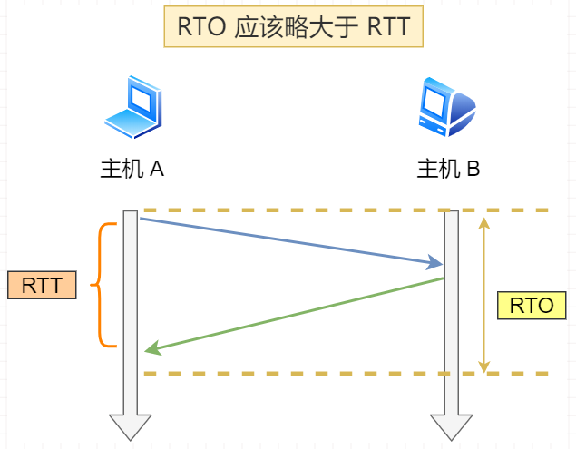
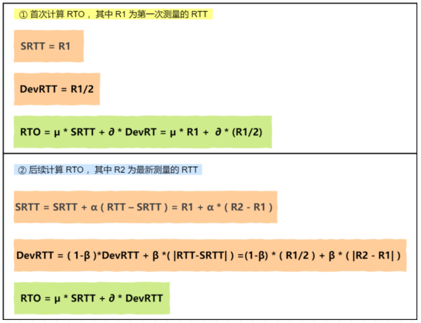
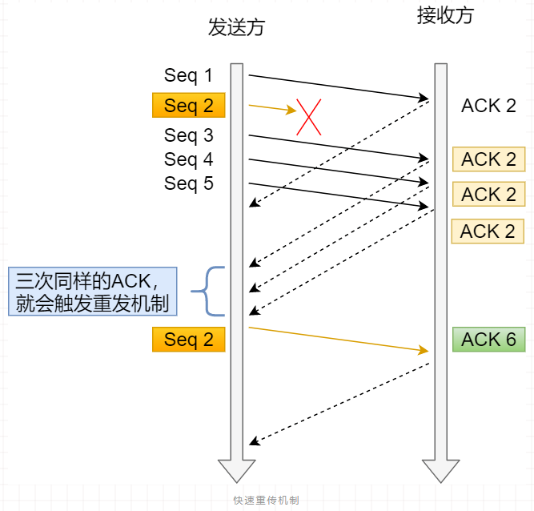
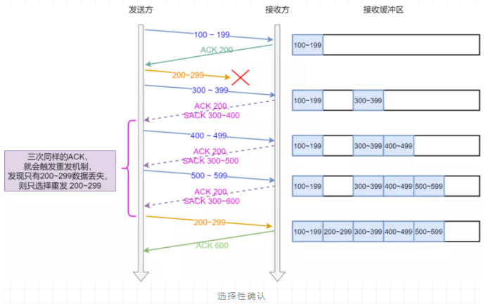

常见重传机制包括：超时重传，快速重传，SACK，D-SACK

### 超时重传

在发送数据时，设定一个定时器当超过指定的时间后，如果没有收到对方的 `ACK` 确认应答报文，则重发该数据。比如：数据包丢失、确认应答丢失。

超时重传时间以 `RTO` （Retransmission Timeout）表示。超时重传时间 RTO 的值略大于报文往返 `RTT`（Round-Trip Time 往返时延）的值。
> 由于RTT 的值会随网络波动而变化，因此RTO也是动态变化的值。

- 采样 RTT 的时间，然后进行加权平均，算出一个平滑 RTT 的值
- 采样 RTT 的波动范围，用于发现RTT中的大波动

如果已超时重发的数据，当再次超时而需要重传的时候将设置**超时间为上次超时时间的两倍**。

RFC6289 建议使用以下的公式计算 RTO：

其中 `SRTT` 是计算平滑的RTT ，`DevRTR` 是计算平滑的RTT 与 最新 RTT 的差距。在 Linux 下，**α = 0.125，β = 0.25， μ = 1，∂ = 4**。

### 快速重传

从时间为驱动转为以数据驱动重传，当收到三个相同的 ACK 报文时，会在定时器过期之前重传丢失的报文段。

- Seq1 先送到了，于是就 Ack 回 2；
- 结果 Seq2 因为某些原因没收到，Seq3、Seq4 和 Seq5  到达了，还是 Ack 回 2；
- **发送端收到了三个 Ack = 2 的确认，就会在定时器过期之前，重传丢失的 Seq2。**
- 最后，接收到收到了 Seq2，此时因为 Seq3，Seq4，Seq5 都收到了，于是 Ack 回 6 。

快速重传机制只解决了超时时间的问题，依旧尚未确定是否需要重传所有报文，比如重传 Seq2即可，还是需要重传 Seq2、Seq3、Seq4、Seq5 。
> 因为Seq3、Seq4、Seq5都返回ack2，因此发送端并不清楚接收端已经成功接收了哪些报文。

### SACK 

sack（Selective Acknowledgment 选择性确认），通过在 TCP 头部「选项」字段设置属性 `SACK`用于通知发送端接收端已经成功接收的报文。

发送方收到了三次同样的 ACK 确认报文，于是触发快速重发机制，然后通过 `SACK` 信息发现只有 `200-299` 这段数据丢失，则重发只选择接收端缺失的报文段即可。

> Linux 下，可以通过 `net.ipv4.tcp_sack` 参数打开这个功能（Linux 2.4 后默认打开）。

### Duplicate SACK

RFC2883对SACK进行了扩展，称为`D-SACK`(Duplicate SACK)：使得扩展后的SACK具有通知发送端哪些数据被重复接收了。

通过D-SACK这种方法，发送方可以更仔细判断出当前网络的传输情况，可以发现数据段被网络复制、错误重传、ACK丢失引起的重传、重传超时等异常的网络状。D-SACK使用了SACK的第一个段来做标志：

1. 如果SACK的第一个段的范围被ACK所覆盖，那么就是D-SACK

2. 如果SACK的第一个段的范围被SACK的第二个段覆盖，那么就是D-SACK

> 在 Linux 下可以通过 `net.ipv4.tcp_dsack` 参数开启/关闭这个功能（Linux 2.4 后默认打开）。

引入D-SACK的目的是使TCP进行更好的流控，具体来说有以下几个好处：

1. 让发送方知道，是发送的包丢了，还是返回的ACK包丢了；

2. 网络上是否出现了包失序；

3. 数据包是否被网络上的路由器复制并转发了

4. 是不是自己的timeout太小了，导致重传

[[D-SACK]]

